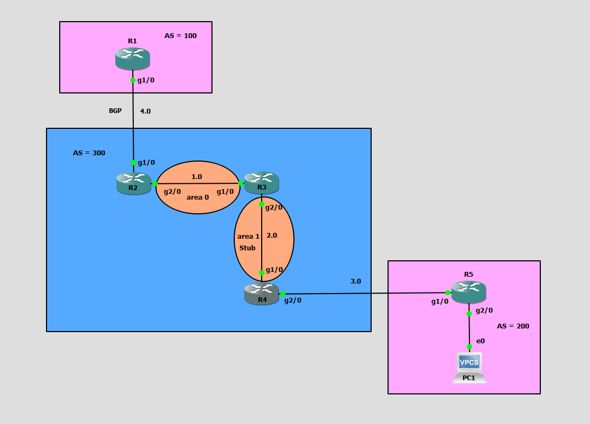
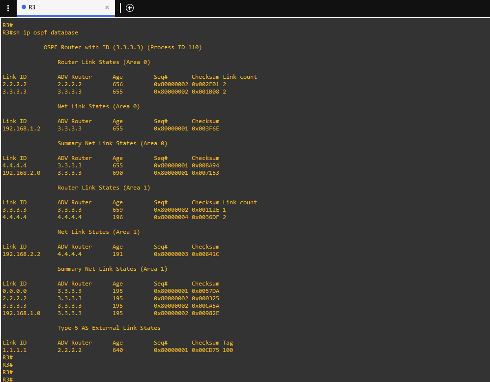
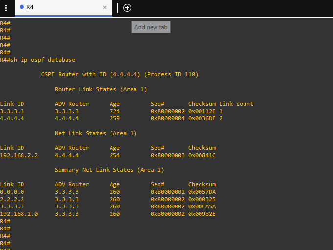
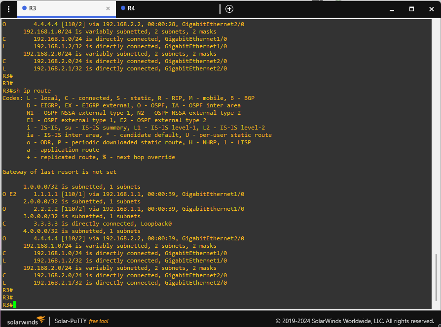
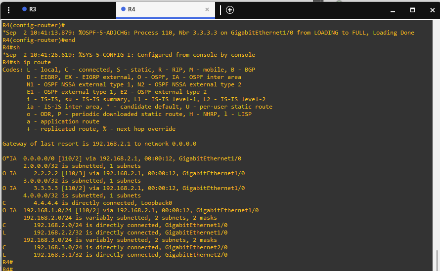

# 🌐 Lab 8: OSPF Stub Area & eBGP Route Redistribution Lab

Welcome to **Lab 8: OSPF Stub Area & eBGP Route Redistribution Lab**! This project demonstrates the design, configuration, and verification of an **OSPF Stub Area** in a multi-area OSPF network integrated with **External BGP (eBGP)** route redistribution.

---

## 📸 Topology Diagram



---

## 🎯 Lab Objectives

1. **eBGP Peering**: Configure eBGP peering between Autonomous System 100 (`R1`) and Autonomous System 300 (`R2`) over the `192.168.4.0/24` interconnect.
2. **OSPF Multi-Area Core**: Configure OSPF 110 across AS 300 containing:
   - **Area 0 (Backbone Area)**: Connecting ASBR `R2` (`2.2.2.2`) and ABR `R3` (`3.3.3.3`) over `192.168.1.0/24`.
   - **Area 1 (Stub Area)**: Connecting ABR `R3` (`3.3.3.3`) and Internal Router `R4` (`4.4.4.4`) over `192.168.2.0/24`.
3. **Route Redistribution**: Redistribute eBGP routes into OSPF on ASBR `R2` and OSPF routes into eBGP.
4. **OSPF Stub Area Implementation**: Configure Area 1 as an **OSPF Stub Area** on both ABR `R3` and Internal Router `R4` using `area 1 stub`.
5. **Verification & Analysis**:
   - Verify the blocking of **Type 5 AS-External LSAs** from entering Area 1.
   - Verify the automatic injection of a **Type 3 Summary Default Route (`0.0.0.0/0`)** by ABR `R3` into Area 1.
   - Validate routing table simplification on Internal Router `R4`.

---

## 🛠️ Network Addressing & Topology Architecture

| Device | Role | Interface | IP Address | Subnet Mask | OSPF Area / BGP AS |
| :--- | :--- | :--- | :--- | :--- | :--- |
| **R1** | External BGP Peer | `Loopback0` | `1.1.1.1` | `255.255.255.255` | BGP AS 100 |
| | | `GigabitEthernet1/0` | `192.168.4.1` | `255.255.255.0` | BGP AS 100 |
| **R2** | ASBR / Area 0 Backbone Router | `Loopback0` | `2.2.2.2` | `255.255.255.255` | OSPF Area 0 / BGP AS 300 |
| | | `GigabitEthernet1/0` | `192.168.4.2` | `255.255.255.0` | BGP AS 300 |
| | | `GigabitEthernet2/0` | `192.168.1.1` | `255.255.255.0` | OSPF Area 0 |
| **R3** | ABR (Area 0 ↔ Area 1) | `Loopback0` | `3.3.3.3` | `255.255.255.255` | OSPF Area 0 |
| | | `GigabitEthernet1/0` | `192.168.1.2` | `255.255.255.0` | OSPF Area 0 |
| | | `GigabitEthernet2/0` | `192.168.2.1` | `255.255.255.0` | OSPF Area 1 (Stub) |
| **R4** | Internal Stub Router | `Loopback0` | `4.4.4.4` | `255.255.255.255` | OSPF Area 1 (Stub) |
| | | `GigabitEthernet1/0` | `192.168.2.2` | `255.255.255.0` | OSPF Area 1 (Stub) |
| | | `GigabitEthernet2/0` | `192.168.3.1` | `255.255.255.0` | External LAN / AS 200 |
| **R5** | External LAN Router | `GigabitEthernet1/0` | `192.168.3.2` | `255.255.255.0` | AS 200 |
| **PC1** | Client Host | `eth0` | Dynamic / Static | `/24` | AS 200 |

---

## 🧠 Key OSPF Stub Area Concepts

### 1. What is an OSPF Stub Area?
An **OSPF Stub Area** is a non-backbone area configured to shield internal routers from external routing information. In standard OSPF areas, when external routes are redistributed into OSPF by an ASBR (like `R2` redistributing BGP route `1.1.1.1/32`), they flood across all areas as **Type 5 AS External LSAs**.

In large enterprise networks, flooding external LSAs to edge routers consumes unnecessary memory, bandwidth, and CPU cycles during SPF recalculations.

### 2. How Stub Areas Work
* **Filtering Type 5 LSAs**: The Area Border Router (`R3`) blocks Type 5 AS-External LSAs from being advertised into Area 1.
* **Automatic Default Route Injection**: To maintain connectivity to external destinations (such as `1.1.1.1`), the ABR (`R3`) automatically injects a **Type 3 Summary LSA for default route `0.0.0.0/0`** into the stub area.
* **Stub Flag Matching**: All routers in the stub area (`R3` and `R4`) **must** be configured with `area 1 stub`. OSPF Hello packets exchange the Stub Option bit (E-bit = 0). If there is a flag mismatch between neighbors, the OSPF adjacency will fail to form.

---

## 📊 Verification & Screenshots

### 1️⃣ OSPF Database Comparison (ABR vs Stub Router)

#### ABR `R3` LSDB (`show ip ospf database`)
The ABR `R3` connects Backbone Area 0 and Stub Area 1. Because `R3` participates in Area 0, it receives **Type-5 AS External LSAs** (`1.1.1.1`) advertised by ASBR `R2`. Notice how `R3` advertises a **Type-3 Summary LSA (`0.0.0.0`)** into Area 1.



#### Internal Stub Router `R4` LSDB (`show ip ospf database`)
Inside Stub Area 1, `R4` displays **NO Type-5 AS External Link States**! The Type-5 LSA section is completely absent. `R4` only receives Router LSAs (Type 1), Network LSAs (Type 2), and Summary LSAs (Type 3) — including the injected `0.0.0.0` summary route.



---

### 2️⃣ Routing Table Verification

#### ABR `R3` Routing Table (`show ip route`)
ABR `R3` maintains explicit external routes in its routing table (`O E2 1.1.1.1 [110/1] via 192.168.1.1`):



#### Internal Stub Router `R4` Routing Table (`show ip route`)
Inside Stub Area 1, `R4` does **not** have an explicit `O E2` route for `1.1.1.1`. Instead, it has a default route:
`O*IA 0.0.0.0/0 [110/2] via 192.168.2.1, GigabitEthernet1/0`
`Gateway of last resort is 192.168.2.1 to network 0.0.0.0`

This default route handles all traffic destined for external subnets, optimizing `R4`'s memory footprint and routing table size.



---

## ⚙️ Router Configurations

### 🔹 Router R1 (eBGP Peer - AS 100)
```cisco
hostname R1
!
interface Loopback0
 ip address 1.1.1.1 255.255.255.255
!
interface GigabitEthernet1/0
 ip address 192.168.4.1 255.255.255.0
 negotiation auto
!
router bgp 100
 bgp log-neighbor-changes
 network 1.1.1.1 mask 255.255.255.255
 neighbor 192.168.4.2 remote-as 300
```

### 🔹 Router R2 (ASBR & Area 0 Router - AS 300)
```cisco
hostname R2
!
interface Loopback0
 ip address 2.2.2.2 255.255.255.255
!
interface GigabitEthernet1/0
 ip address 192.168.4.2 255.255.255.0
 negotiation auto
!
interface GigabitEthernet2/0
 ip address 192.168.1.1 255.255.255.0
 negotiation auto
!
router ospf 110
 redistribute bgp 300 subnets
 network 2.2.2.2 0.0.0.0 area 0
 network 192.168.1.0 0.0.0.255 area 0
!
router bgp 300
 bgp log-neighbor-changes
 redistribute ospf 110
 neighbor 192.168.4.1 remote-as 100
```

### 🔹 Router R3 (Area Border Router ABR - Area 0 & Area 1 Stub)
```cisco
hostname R3
!
interface Loopback0
 ip address 3.3.3.3 255.255.255.255
!
interface GigabitEthernet1/0
 ip address 192.168.1.2 255.255.255.0
 negotiation auto
!
interface GigabitEthernet2/0
 ip address 192.168.2.1 255.255.255.0
 negotiation auto
!
router ospf 110
 area 1 stub
 network 3.3.3.3 0.0.0.0 area 0
 network 192.168.1.0 0.0.0.255 area 0
 network 192.168.2.0 0.0.0.255 area 1
```

### 🔹 Router R4 (Internal Stub Router - Area 1 Stub)
```cisco
hostname R4
!
interface Loopback0
 ip address 4.4.4.4 255.255.255.255
!
interface GigabitEthernet1/0
 ip address 192.168.2.2 255.255.255.0
 negotiation auto
!
interface GigabitEthernet2/0
 ip address 192.168.3.1 255.255.255.0
 negotiation auto
!
router ospf 110
 area 1 stub
 network 4.4.4.4 0.0.0.0 area 1
 network 192.168.2.0 0.0.0.255 area 1
```

---

## 🔍 Verification Commands

To verify OSPF Stub Area operation on your Cisco IOS devices:

```cisco
# 1. Check OSPF Neighbor Adjacency
R4# show ip ospf neighbor

# 2. Verify OSPF Area 1 Stub Status
R4# show ip ospf

# 3. Check LSDB for absent Type 5 LSAs and presence of 0.0.0.0 Summary LSA
R4# show ip ospf database
R4# show ip ospf database summary 0.0.0.0

# 4. Inspect IP Routing Table for default route (O*IA 0.0.0.0/0)
R4# show ip route
R4# show ip route ospf

# 5. Ping external BGP loopback from R4 using default route
R4# ping 1.1.1.1 source 4.4.4.4
```

---

## 📝 Summary of OSPF Area Types

| OSPF Area Type | Allows Type 1 & 2 LSAs? | Allows Type 3 LSAs? | Allows Type 5 LSAs? | Auto Injects Default Route? |
| :--- | :---: | :---: | :---: | :---: |
| **Standard Area** | ✅ Yes | ✅ Yes | ✅ Yes | ❌ No |
| **Stub Area (Lab 8)** | ✅ Yes | ✅ Yes | ❌ No | ✅ Yes (Type 3 `0.0.0.0`) |
| **Totally Stubby Area** | ✅ Yes | ❌ No (Except Default) | ❌ No | ✅ Yes (Type 3 `0.0.0.0`) |
| **NSSA (Not-So-Stubby)** | ✅ Yes | ✅ Yes | ❌ No (Allows Type 7) | ❌ Manual configuration |
| **Totally NSSA** | ✅ Yes | ❌ No (Except Default) | ❌ No (Allows Type 7) | ✅ Yes (Type 3 `0.0.0.0`) |

---

## 👤 Author & Repository

- **Repository**: [Networking Labs](https://github.com/chakreshram11/Networking-Labs)
- **Author**: Kudupudi Chakresh Ram (`chakreshram11`)
