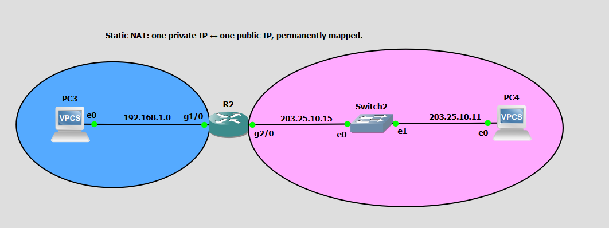
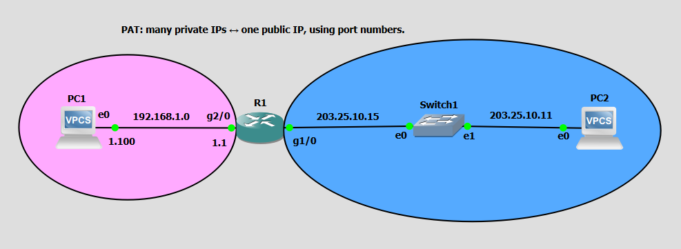

# Cisco NAT & PAT Lab

A practical **Cisco IOS Network Address Translation (NAT) lab** built in **GNS3** using Cisco routers, switches, and VPCS hosts.

This project demonstrates the configuration, operation, and verification of:

* Static NAT
* PAT / NAT Overload
* Inside and outside NAT interfaces
* Private-to-public address translation
* NAT translation table verification
* Connectivity testing using ICMP

---

## 📌 Project Overview

Network Address Translation (NAT) allows private IP addresses to communicate with external networks by translating them into public IP addresses.

This lab covers two common NAT implementations:

| NAT Type       | Mapping                 | Main Purpose                           |
| -------------- | ----------------------- | -------------------------------------- |
| **Static NAT** | 1 Private → 1 Public    | Permanent address mapping              |
| **PAT**        | Many Private → 1 Public | Share one public IP using port numbers |

The lab uses separate topologies to clearly demonstrate how each NAT method works.

---

# 🧪 Lab 1 — Static NAT

### Topology



### Network Design

```text
                 STATIC NAT
          1 Private ↔ 1 Public IP

 PC3                                      PC4
192.168.1.100                         203.25.10.11
     |                                      |
     |                                      |
     | G1/0                    G2/0         |
     +------ R2 ----------------------------+
            |                    |
       192.168.1.1          203.25.10.15
       NAT INSIDE           NAT OUTSIDE
```

### IP Addressing

| Device          | Interface | IP Address         | NAT Role      |
| --------------- | --------- | ------------------ | ------------- |
| PC3             | e0        | `192.168.1.100/24` | Inside Host   |
| R2              | G1/0      | `192.168.1.1/24`   | NAT Inside    |
| R2              | G2/0      | `203.25.10.15/24`  | NAT Outside   |
| PC4             | e0        | `203.25.10.11/24`  | Outside Host  |
| PC3 NAT Address | —         | `203.25.10.100`    | Inside Global |

### Address Translation

```text
Inside Local
192.168.1.100
      │
      │ Static NAT
      ▼
Inside Global
203.25.10.100
```

PC3's private address `192.168.1.100` is permanently mapped to `203.25.10.100`.

---

## ⚙️ Static NAT Configuration

### Configure the inside interface

```cisco
R2(config)# interface GigabitEthernet1/0
R2(config-if)# ip address 192.168.1.1 255.255.255.0
R2(config-if)# ip nat inside
R2(config-if)# no shutdown
```

### Configure the outside interface

```cisco
R2(config)# interface GigabitEthernet2/0
R2(config-if)# ip address 203.25.10.15 255.255.255.0
R2(config-if)# ip nat outside
R2(config-if)# no shutdown
```

### Configure Static NAT

```cisco
R2(config)# ip nat inside source static 192.168.1.100 203.25.10.100
```

### Save configuration

```cisco
R2# write memory
```

---

## 🔍 Verify Static NAT

Display the NAT translation table:

```cisco
R2# show ip nat translations
```

Expected result:

```text
Pro  Inside global      Inside local
---  203.25.10.100      192.168.1.100
```

Check NAT statistics:

```cisco
R2# show ip nat statistics
```

Verify interfaces:

```cisco
R2# show ip interface brief
```

---

## 🧪 Static NAT Testing

From PC3:

```text
PC3> ping 203.25.10.11
```

From PC4:

```text
PC4> ping 203.25.10.100
```

The second test demonstrates access to PC3 through its translated address:

```text
PC4
203.25.10.11
     |
     | 203.25.10.100
     ↓
    R2
     |
     | NAT
     ↓
PC3
192.168.1.100
```

---

# 🧪 Lab 2 — PAT / NAT Overload

### Topology



### Network Design

```text
                  PAT / NAT OVERLOAD

 PC1                                      PC2
192.168.1.100                         203.25.10.11
     |                                      |
     |                                      |
     | G2/0                    G1/0         |
     +------ R1 ----------------------------+
            |                    |
       192.168.1.1          203.25.10.15
       NAT INSIDE           NAT OUTSIDE
```

### IP Addressing

| Device | Interface | IP Address         | NAT Role     |
| ------ | --------- | ------------------ | ------------ |
| PC1    | e0        | `192.168.1.100/24` | Inside Host  |
| R1     | G2/0      | `192.168.1.1/24`   | NAT Inside   |
| R1     | G1/0      | `203.25.10.15/24`  | NAT Outside  |
| PC2    | e0        | `203.25.10.11/24`  | Outside Host |

---

## ⚙️ PAT Configuration

### Configure the inside interface

```cisco
R1(config)# interface GigabitEthernet2/0
R1(config-if)# ip address 192.168.1.1 255.255.255.0
R1(config-if)# ip nat inside
R1(config-if)# no shutdown
```

### Configure the outside interface

```cisco
R1(config)# interface GigabitEthernet1/0
R1(config-if)# ip address 203.25.10.15 255.255.255.0
R1(config-if)# ip nat outside
R1(config-if)# no shutdown
```

---

## 🔐 Configure the NAT ACL

The ACL identifies which private network is allowed to be translated.

```cisco
R1(config)# access-list 1 permit 192.168.1.0 0.0.0.255
```

This matches:

```text
192.168.1.0/24
```

including PC1:

```text
192.168.1.100
```

---

## 🌐 Configure PAT

```cisco
R1(config)# ip nat inside source list 1 interface GigabitEthernet1/0 overload
```

This tells R1:

> Translate traffic from the addresses permitted by ACL 1 using the IP address of G1/0, and use port numbers to allow multiple connections to share the same public IP.

Therefore:

```text
192.168.1.100
       │
       │ PAT
       ▼
203.25.10.15
```

---

# 🔍 Verify PAT

Display NAT translations:

```cisco
R1# show ip nat translations
```

Display NAT statistics:

```cisco
R1# show ip nat statistics
```

Verify the ACL:

```cisco
R1# show access-lists
```

Verify interfaces:

```cisco
R1# show ip interface brief
```

---

## 🧪 PAT Testing

From PC1:

```text
PC1> ping 203.25.10.11
```

Then check:

```cisco
R1# show ip nat translations
```

The translation table should show traffic involving:

```text
Inside Local:   192.168.1.100
Inside Global:  203.25.10.15
```

---

# 🔄 Static NAT vs PAT

| Feature          | Static NAT                      | PAT                            |
| ---------------- | ------------------------------- | ------------------------------ |
| Mapping          | 1:1                             | Many:1                         |
| Public IPs       | One per mapped host             | Can use one shared IP          |
| Port Translation | No                              | Yes                            |
| Mapping          | Permanent                       | Created dynamically            |
| Common Use       | Servers                         | Internet access                |
| Configuration    | Static mapping                  | ACL + overload                 |
| Example          | `192.168.1.100 ↔ 203.25.10.100` | `192.168.1.100 → 203.25.10.15` |

### Static NAT

```text
192.168.1.100
      ↕
203.25.10.100
```

### PAT

```text
192.168.1.100 ─┐
192.168.1.101 ─┼──→ 203.25.10.15
192.168.1.102 ─┘
```

PAT distinguishes simultaneous connections using TCP/UDP port numbers.

---

# 🧠 Key Concepts Learned

### 1. NAT Inside

The interface connected to the private network is configured as:

```cisco
ip nat inside
```

### 2. NAT Outside

The interface connected to the external network is configured as:

```cisco
ip nat outside
```

### 3. Inside Local

The original private address of the internal host.

Example:

```text
192.168.1.100
```

### 4. Inside Global

The address representing the internal host on the external network.

Example:

```text
203.25.10.100
```

for Static NAT.

### 5. NAT Overload

Allows multiple private hosts to share a single public IP by using port numbers.

---

# 🛠️ Technologies Used

* **GNS3**
* **Cisco IOS**
* **Cisco Routers**
* **Ethernet/GigabitEthernet**
* **VPCS**
* **IPv4**
* **ICMP**
* **Static NAT**
* **PAT / NAT Overload**
* **Cisco ACL**

---

# 📁 Suggested Repository Structure

```text
Eighteenth_Lab_Static_NAT_and_PAT/
│
├── README.md
│
├── images/
│   ├── static-nat-topology.png
│   └── pat-topology.png
│
├── project-files/
│   └── dynamips/
└── NAT.gns3
```

---

# 📋 Useful Verification Commands

```cisco
show ip interface brief
show running-config
show access-lists
show ip nat translations
show ip nat statistics
```

Clear dynamic NAT translations:

```cisco
clear ip nat translation *
```

Save configuration:

```cisco
write memory
```

---

# 🎯 Learning Objectives

By completing this lab, you will understand how to:

* Configure Cisco NAT inside and outside interfaces
* Configure one-to-one Static NAT
* Configure PAT/NAT Overload
* Create a NAT ACL
* Understand Inside Local and Inside Global addresses
* Verify NAT translations
* Troubleshoot NAT connectivity
* Analyze NAT statistics and translation tables
* Understand the difference between Static NAT and PAT

---

# ⚠️ Troubleshooting

If NAT is not working, verify the following:

### Check interface status

```cisco
show ip interface brief
```

Interfaces should be:

```text
up    up
```

### Check NAT roles

```cisco
show running-config
```

Confirm:

```cisco
ip nat inside
ip nat outside
```

### Check Static NAT

```cisco
show ip nat translations
```

### Check PAT ACL

```cisco
show access-lists
```

Make sure the private network is permitted:

```text
192.168.1.0/24
```

### Check connectivity before NAT

Test the directly connected interfaces first:

```text
PC3 → R2 inside
PC4 → R2 outside
```

NAT troubleshooting is pointless if the underlying IP connectivity is broken.

---

# 📌 Important Note

This is a **controlled GNS3 lab environment** designed to demonstrate NAT behavior. The outside network shown in the topology is a simulated network rather than a real Internet connection.

---

# 👨‍💻 Author

**Chakresh Ram**

Cybersecurity | Network Engineering | SOC | Cisco | GNS3

---

## ⭐ Project Highlights

```text
Cisco IOS
     │
     ├── Static NAT
     │      └── 1:1 Private → Public
     │
     └── PAT
            └── Many:1 Private → Public
                    │
                    └── Port Translation
```

**Skills demonstrated:** `Cisco IOS` · `NAT` · `PAT` · `ACL` · `IPv4` · `GNS3` · `Network Troubleshooting` · `VPCS`
