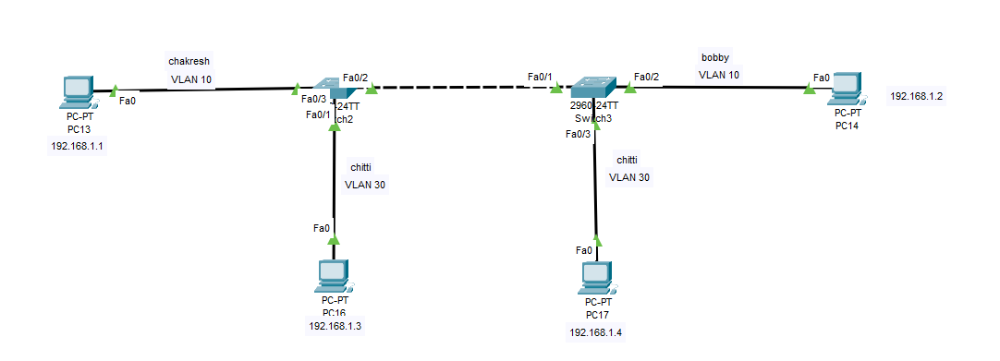

# 🌐 Cisco VLAN & Trunking Lab

A Cisco Packet Tracer networking lab demonstrating **VLAN configuration, access ports, and 802.1Q trunking between two Cisco 2960 switches**.

This lab demonstrates how multiple VLANs can be configured across multiple switches using an **802.1Q trunk link**, while end devices remain logically separated into their respective VLANs.

---

## 📸 Topology Diagram



---

## 📌 Lab Overview

### Objectives

- Create and configure VLANs on Cisco switches
- Assign switch ports to specific VLAN access modes
- Configure 802.1Q trunk ports between switches
- Allow multiple VLANs across a single trunk link
- Verify VLAN membership and trunk operation
- Test connectivity between devices in the same VLAN
- Understand Layer 2 VLAN segmentation
- Understand why inter-VLAN communication requires Layer 3 routing
- Evaluate the advantages and disadvantages of VLANs and Trunking

---

## 🗺️ Network Topology

```text
                         802.1Q TRUNK
                 Fa0/2 ================= Fa0/1
              +---------+              +---------+
              | Switch2 |              | Switch3 |
              | 2960    |              | 2960    |
              +----+----+              +----+----+
                   |                         |
                 Fa0/3                     Fa0/2
                   |                         |
                VLAN 10                    VLAN 10
                   |                         |
              +---------+              +---------+
              |  PC13   |              |  PC14   |
              |192.168.1.1|            |192.168.1.2|
              +---------+              +---------+

                   |                         |
                 Fa0/1                     Fa0/3
                   |                         |
                VLAN 30                    VLAN 30
                   |                         |
              +---------+              +---------+
              |  PC16   |              |  PC17   |
              |192.168.1.3|            |192.168.1.4|
              +---------+              +---------+
```

### Simplified View

```text
PC13 ── VLAN 10 ── Switch2 ═══ TRUNK ═══ Switch3 ── VLAN 10 ── PC14
                       │                    │
                    VLAN 30              VLAN 30
                       │                    │
                     PC16                 PC17
```

---

## 🖥️ Devices

| Device | Model | Role |
| :--- | :--- | :--- |
| **Switch2** | Cisco 2960-24TT | VLAN & Trunk configuration |
| **Switch3** | Cisco 2960-24TT | VLAN & Trunk configuration |
| **PC13** | PC-PT | VLAN 10 Host |
| **PC14** | PC-PT | VLAN 10 Host |
| **PC16** | PC-PT | VLAN 30 Host |
| **PC17** | PC-PT | VLAN 30 Host |

---

## 🌐 IP Addressing

| Device | VLAN ID | IP Address | Subnet Mask | Interface |
| :--- | :---: | :--- | :--- | :--- |
| **PC13** | 10 | `192.168.1.1` | `255.255.255.0` | `FastEthernet0` ➔ `Switch2 Fa0/3` |
| **PC14** | 10 | `192.168.1.2` | `255.255.255.0` | `FastEthernet0` ➔ `Switch3 Fa0/2` |
| **PC16** | 30 | `192.168.1.3` | `255.255.255.0` | `FastEthernet0` ➔ `Switch2 Fa0/1` |
| **PC17** | 30 | `192.168.1.4` | `255.255.255.0` | `FastEthernet0` ➔ `Switch3 Fa0/3` |

> **Note:** This lab focuses on Layer 2 VLAN and trunking concepts. No router or Layer 3 switch is used.

---

## 🔧 VLAN Table

| VLAN ID | VLAN Name | Purpose | Assigned Ports |
| :---: | :--- | :--- | :--- |
| **10** | `CHAKRESH` | VLAN 10 Hosts | `Switch2 Fa0/3`, `Switch3 Fa0/2` |
| **30** | `CHITTI` | VLAN 30 Hosts | `Switch2 Fa0/1`, `Switch3 Fa0/3` |

Both switches must have VLAN 10 and VLAN 30 created so that VLAN tags can be processed and forwarded across the trunk link.

---

## ⚙️ Switch Configurations

### 🔹 Switch2 Configuration

Enter privileged EXEC mode:
```cisco
enable
configure terminal
hostname Switch2
```

#### Create VLAN 10
```cisco
vlan 10
 name CHAKRESH
 exit
```

#### Create VLAN 30
```cisco
vlan 30
 name CHITTI
 exit
```

#### Configure PC13 Access Port (VLAN 10)
PC13 is connected to `Fa0/3`:
```cisco
interface FastEthernet0/3
 switchport mode access
 switchport access vlan 10
 no shutdown
 exit
```

#### Configure PC16 Access Port (VLAN 30)
PC16 is connected to `Fa0/1`:
```cisco
interface FastEthernet0/1
 switchport mode access
 switchport access vlan 30
 no shutdown
 exit
```

#### Configure 802.1Q Trunk Link
Switch2 `Fa0/2` connects to Switch3 `Fa0/1`:
```cisco
interface FastEthernet0/2
 switchport mode trunk
 switchport trunk allowed vlan 10,30
 no shutdown
 exit
```

Save configuration:
```cisco
end
write memory
```

---

### 🔹 Switch3 Configuration

Enter privileged EXEC mode:
```cisco
enable
configure terminal
hostname Switch3
```

#### Create VLAN 10
```cisco
vlan 10
 name CHAKRESH
 exit
```

#### Create VLAN 30
```cisco
vlan 30
 name CHITTI
 exit
```

#### Configure PC14 Access Port (VLAN 10)
PC14 is connected to `Fa0/2`:
```cisco
interface FastEthernet0/2
 switchport mode access
 switchport access vlan 10
 no shutdown
 exit
```

#### Configure PC17 Access Port (VLAN 30)
PC17 is connected to `Fa0/3`:
```cisco
interface FastEthernet0/3
 switchport mode access
 switchport access vlan 30
 no shutdown
 exit
```

#### Configure 802.1Q Trunk Link
Switch3 `Fa0/1` connects to Switch2 `Fa0/2`:
```cisco
interface FastEthernet0/1
 switchport mode trunk
 switchport trunk allowed vlan 10,30
 no shutdown
 exit
```

Save configuration:
```cisco
end
write memory
```

---

## ⚖️ Advantages and Disadvantages

### 🔹 Virtual Local Area Networks (VLANs)

#### ✅ Advantages of VLANs
1. **Broadcast Control & Traffic Isolation**: Limits Layer 2 broadcast storms to individual VLANs, preventing broadcast traffic from degrading entire physical switch networks.
2. **Enhanced Network Security**: Logically isolates sensitive hosts (e.g., HR, Finance) at Layer 2. Devices in different VLANs cannot intercept or sniff each other's traffic without passing through a firewalled Layer 3 device.
3. **Cost Reduction & Hardware Efficiency**: Reuses existing physical switch infrastructure to create multiple isolated logical networks without purchasing dedicated physical switches per department.
4. **Administrative Flexibility**: Users can be relocated anywhere in a building and reassigned to their department VLAN via switchport configuration without physically altering cable runs.

#### ❌ Disadvantages of VLANs
1. **VLAN Hopping Vulnerabilities**: Misconfigured switchports (e.g., dynamic trunking auto/desirable or native VLAN mismatches) can allow malicious users to inject double-tagged 802.1Q frames and hop into unauthorized VLANs.
2. **Layer 3 Routing Overhead**: Devices in different VLANs cannot communicate directly at Layer 2; requiring Inter-VLAN routing (Router-on-a-Stick or Layer 3 switch) increases routing latency and processing overhead.
3. **Configuration Complexity**: Managing VLAN IDs, naming consistency, and access port assignments across large multi-switch environments increases administrative work.

---

### 🔹 802.1Q Trunk Links

#### ✅ Advantages of Trunk Links
1. **Massive Physical Cable Savings**: Consolidates traffic for hundreds of VLANs over a single high-speed physical link or EtherChannel bundle instead of running separate physical cables for each VLAN.
2. **Open Standard Interoperability**: IEEE 802.1Q is a vendor-neutral industry standard supported across all major network vendors (Cisco, HP, Juniper, Arista).
3. **Simplified Multi-Switch Topologies**: Facilitates clean, scalable interconnections between access, distribution, and core switches across enterprise floors and buildings.

#### ❌ Disadvantages of Trunk Links
1. **Single Point of Failure**: If a physical trunk link fails, all VLANs traversing that link lose connectivity simultaneously unless redundant trunk paths (STP/EtherChannel) are configured.
2. **Native VLAN Traversal Security Risk**: Un-encapsulated native VLAN traffic on 802.1Q trunks can expose networks to native VLAN exploitation if left as default VLAN 1.
3. **Link Congestion / Oversubscription**: Heavy traffic across multiple active VLANs sharing a single trunk link can lead to interface buffer congestion if bandwidth is not managed with Quality of Service (QoS).

---

## 🔍 Verification Commands

### 1. Check VLAN Configuration
Run on both switches:
```cisco
show vlan brief
```
Verify that:
- VLAN 10 (`CHAKRESH`) exists and is active.
- VLAN 30 (`CHITTI`) exists and is active.
- Access ports (`Fa0/3`, `Fa0/1`, `Fa0/2`) are correctly assigned.

### 2. Check Trunk Configuration
Run:
```cisco
show interfaces trunk
```
Verify that:
- The inter-switch interface (`Fa0/2` on Switch2, `Fa0/1` on Switch3) is operating as an 802.1Q trunk.
- VLANs 10 and 30 are allowed and active on the trunk.

### 3. Check Interface Switchport Status
For trunk interface:
```cisco
show interfaces fa0/2 switchport
```
Verify:
```text
Administrative Mode: trunk
Operational Mode: trunk
Administrative Trunking Encapsulation: dot1q
Operational Trunking Encapsulation: dot1q
```

For access interface:
```cisco
show interfaces fa0/3 switchport
```
Verify:
```text
Administrative Mode: static access
Operational Mode: static access
Access Mode VLAN: 10 (CHAKRESH)
```

### 4. Check MAC Address Table
```cisco
show mac address-table
```
Verifies that switches are learning source MAC addresses on their expected VLANs and interfaces.

---

## 🧪 Connectivity Testing

### 🔹 VLAN 10 Connectivity Test
- **PC13** (`VLAN 10`): `192.168.1.1/24`
- **PC14** (`VLAN 10`): `192.168.1.2/24`

From PC13 Command Prompt:
```cmd
ping 192.168.1.2
```
**Expected Result**:
```text
Reply from 192.168.1.2: bytes=32 time<1ms TTL=128
```
*Successful because both PCs belong to VLAN 10, and VLAN 10 traffic is carried across the 802.1Q trunk link.*

---

### 🔹 VLAN 30 Connectivity Test
- **PC16** (`VLAN 30`): `192.168.1.3/24`
- **PC17** (`VLAN 30`): `192.168.1.4/24`

From PC16 Command Prompt:
```cmd
ping 192.168.1.4
```
**Expected Result**:
```text
Reply from 192.168.1.4: bytes=32 time<1ms TTL=128
```
*Successful because both PCs belong to VLAN 30, and VLAN 30 traffic is carried across the 802.1Q trunk link.*

---

## 🚫 Inter-VLAN Communication & Layer 3 Routing

- **PC13** (`VLAN 10`): `192.168.1.1`
- **PC16** (`VLAN 30`): `192.168.1.3`

From PC13:
```cmd
ping 192.168.1.3
```
**Expected Result**:
```text
Request timed out.
```

### Why Inter-VLAN Ping Fails:
Because this lab operates strictly at **Layer 2**, switches isolate traffic within each VLAN broadcast domain:
```text
VLAN 10 ────── X ────── VLAN 30
```
Inter-VLAN communication requires a **Layer 3 device**, such as:
- Router-on-a-Stick (ROAS) using subinterfaces.
- Layer 3 Switch with Switched Virtual Interfaces (SVIs) and `ip routing`.

---

## 📚 Key Concepts Summary

### 1. VLAN (Virtual LAN)
A VLAN creates a logical Layer 2 broadcast domain within a switch network.
- `VLAN 10` ➔ `CHAKRESH`
- `VLAN 30` ➔ `CHITTI`

### 2. Access Port
An access port carries traffic for a single assigned VLAN without 802.1Q tagging.
```cisco
interface fa0/3
 switchport mode access
 switchport access vlan 10
```

### 3. Trunk Port & 802.1Q Tagging
A trunk port carries traffic for multiple VLANs by adding a 4-byte **IEEE 802.1Q header tag** (containing the 12-bit VLAN ID) to Ethernet frames as they cross inter-switch links:

```text
VLAN 10 Frame ──> [802.1Q Tag: 10] ──> Trunk Link ──> Switch3 ──> Strip Tag ──> PC14 (VLAN 10)
```

---

## 🛠️ Troubleshooting Checklist

If devices in the same VLAN cannot ping each other:
1. **Verify VLAN Creation**: `show vlan brief` (Ensure VLAN IDs match on both switches).
2. **Verify Access Port Assignment**: `show interfaces switchport` (Ensure ports are assigned to correct VLANs).
3. **Verify Trunk Status**: `show interfaces trunk` (Ensure trunk mode is active and VLANs are allowed).
4. **Verify Physical Cable & Port Status**: `show interfaces status` (Ensure interfaces are `connected/up`).
5. **Verify IP Parameters**: Ensure PCs share the correct subnet mask (`255.255.255.0`).

---

## 🎯 Learning Outcomes

After completing this lab, you are able to:
- Create and name VLANs on Cisco switches.
- Assign access ports to specific VLANs.
- Configure IEEE 802.1Q trunk links between switches.
- Allow specific VLAN IDs across trunk links.
- Verify VLAN membership and trunk operation via Cisco IOS CLI commands.
- Demonstrate Layer 2 VLAN segmentation and traffic isolation.
- Troubleshoot common Layer 2 access and trunking issues.
- Explain the requirement for Layer 3 devices for Inter-VLAN routing.

---

## ⚠️ Networking Design Note

This lab uses the same IP subnet (`192.168.1.0/24`) for demonstration purposes. In production enterprise network designs, separate VLANs should always be assigned distinct IP subnets (e.g., `VLAN 10` ➔ `192.168.10.0/24`, `VLAN 30` ➔ `192.168.30.0/24`) with a Layer 3 default gateway to control inter-VLAN routing and security policies.

---

## 💻 Software & Environment

- **Simulator**: Cisco Packet Tracer
- **Switch Hardware**: Cisco Catalyst 2960-24TT
- **Operating System**: Cisco IOS Software

---

## 👨‍💻 Author & License

- **Author**: Kudupudi Chakresh Ram (`chakreshram11`)
- **Repository**: [Networking Labs](https://github.com/chakreshram11/Networking-Labs)
- **Status**: Completed 🟢
