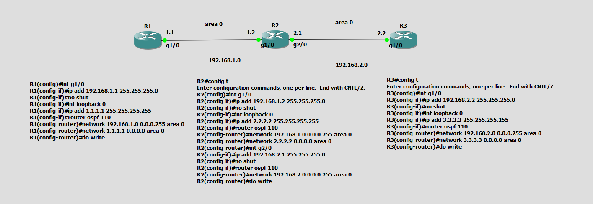
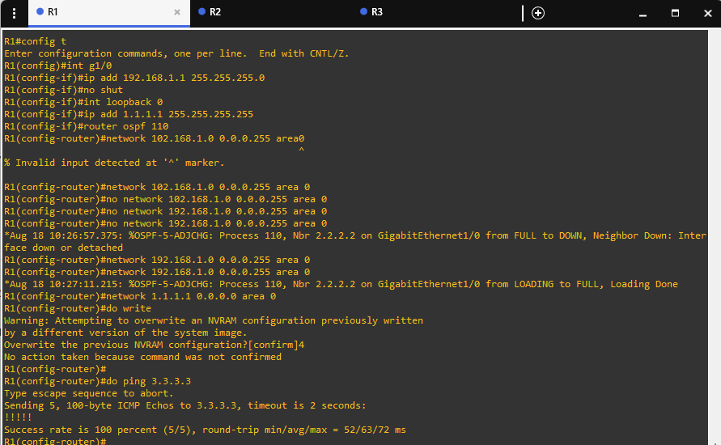
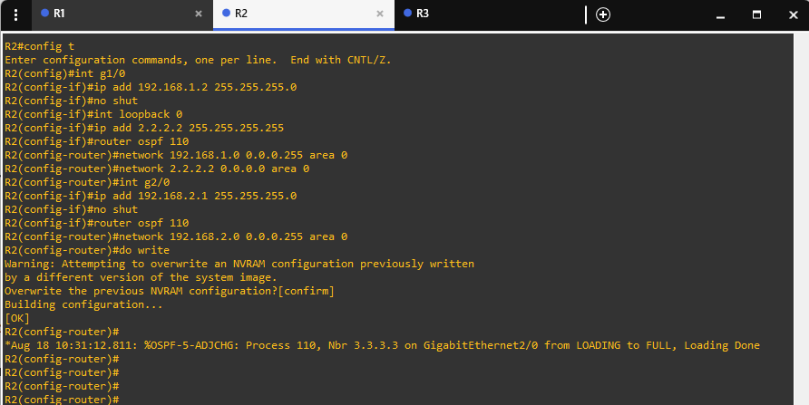
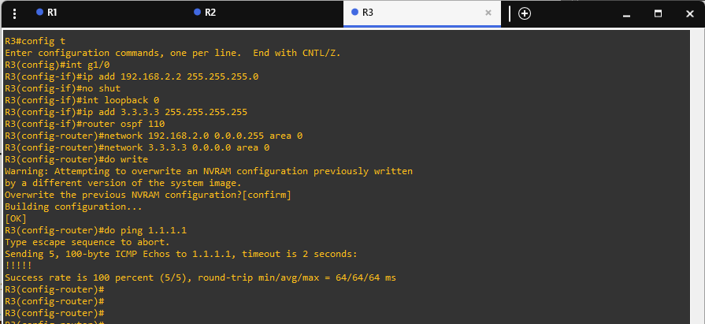

# GNS3 OSPF (Open Shortest Path First) Single-Area Routing Lab

## 📌 Project Overview

This project is a **GNS3 network simulation** demonstrating the dynamic routing configuration and behavior of **OSPF (Open Shortest Path First)** protocol on Cisco IOS routers.

Key concepts and features demonstrated in this lab include:
- **Link-State Dynamic Routing** using OSPF (Process ID: `110`)
- **Single-Area OSPF Architecture** (Area 0 / Backbone Area)
- **Loopback Interface Configuration** for Router ID generation and reachability testing
- **Wildcard Masking** (`0.0.0.255` for `/24` subnets, `0.0.0.0` for `/32` host IPs)
- **OSPF Neighbor Adjacency Formation** (`LOADING to FULL` state transitions)
- **End-to-End Connectivity Verification** using `ping` commands across multi-hop OSPF routes

The topology consists of three interconnected Cisco IOS routers:
- **R1** (Loopback: `1.1.1.1`)
- **R2** (Loopback: `2.2.2.2`)
- **R3** (Loopback: `3.3.3.3`)

---

## 🖥️ Topology



### ASCII Network Diagram

```text
               area 0                               area 0
    R1 ─────────────────────── R2 ─────────────────────── R3
1.1.1.1                    2.2.2.2                    3.3.3.3
(Loopback0)               (Loopback0)                (Loopback0)

         192.168.1.0/24            192.168.2.0/24
    g1/0                 g1/0  g2/0                 g1/0
  .1 (1.1)             .2 (1.2)  .1 (2.1)         .2 (2.2)
```

---

## 📊 IP Addressing & OSPF Plan

| Device | Interface | IP Address | Subnet Mask | Wildcard Mask | OSPF Area | Purpose |
|---|---|---|---|---|---|---|
| **R1** | `GigabitEthernet1/0` | `192.168.1.1` | `255.255.255.0` | `0.0.0.255` | Area 0 | Interconnect R1 ↔ R2 |
| **R1** | `Loopback0` | `1.1.1.1` | `255.255.255.255` | `0.0.0.0` | Area 0 | Router ID / Loopback |
| **R2** | `GigabitEthernet1/0` | `192.168.1.2` | `255.255.255.0` | `0.0.0.255` | Area 0 | Interconnect R2 ↔ R1 |
| **R2** | `GigabitEthernet2/0` | `192.168.2.1` | `255.255.255.0` | `0.0.0.255` | Area 0 | Interconnect R2 ↔ R3 |
| **R2** | `Loopback0` | `2.2.2.2` | `255.255.255.255` | `0.0.0.0` | Area 0 | Router ID / Loopback |
| **R3** | `GigabitEthernet1/0` | `192.168.2.2` | `255.255.255.0` | `0.0.0.255` | Area 0 | Interconnect R3 ↔ R2 |
| **R3** | `Loopback0` | `3.3.3.3` | `255.255.255.255` | `0.0.0.0` | Area 0 | Router ID / Loopback |

---

## ⚙️ Router Configurations

### 1️⃣ R1 Configuration

```cisco
R1# configure terminal
R1(config)# interface g1/0
R1(config-if)# ip address 192.168.1.1 255.255.255.0
R1(config-if)# no shutdown
R1(config-if)# interface loopback 0
R1(config-if)# ip address 1.1.1.1 255.255.255.255
R1(config-if)# exit

R1(config)# router ospf 110
R1(config-router)# network 192.168.1.0 0.0.0.255 area 0
R1(config-router)# network 1.1.1.1 0.0.0.0 area 0
R1(config-router)# do write
```

---

### 2️⃣ R2 Configuration

```cisco
R2# configure terminal
R2(config)# interface g1/0
R2(config-if)# ip address 192.168.1.2 255.255.255.0
R2(config-if)# no shutdown

R2(config-if)# interface loopback 0
R2(config-if)# ip address 2.2.2.2 255.255.255.255

R2(config-if)# router ospf 110
R2(config-router)# network 192.168.1.0 0.0.0.255 area 0
R2(config-router)# network 2.2.2.2 0.0.0.0 area 0

R2(config-router)# interface g2/0
R2(config-if)# ip address 192.168.2.1 255.255.255.0
R2(config-if)# no shutdown

R2(config-if)# router ospf 110
R2(config-router)# network 192.168.2.0 0.0.0.255 area 0
R2(config-router)# do write
```

---

### 3️⃣ R3 Configuration

```cisco
R3# configure terminal
R3(config)# interface g1/0
R3(config-if)# ip address 192.168.2.2 255.255.255.0
R3(config-if)# no shutdown

R3(config-if)# interface loopback 0
R3(config-if)# ip address 3.3.3.3 255.255.255.255

R3(config-if)# router ospf 110
R3(config-router)# network 192.168.2.0 0.0.0.255 area 0
R3(config-router)# network 3.3.3.3 0.0.0.0 area 0
R3(config-router)# do write
```

---

## 🧠 Key OSPF Concepts Explained

### 1. What is OSPF?
**OSPF (Open Shortest Path First)** is an Interior Gateway Protocol (IGP) based on link-state routing technology. It uses **Dijkstra's Shortest Path First (SPF) algorithm** to calculate the shortest path to each network destination.

### 2. OSPF Process ID vs Area ID
- **Process ID (`110`)**: Locally significant number used by Cisco IOS to identify the OSPF routing process on that router. It does not need to match across routers.
- **Area ID (`area 0`)**: Structurally significant OSPF identifier. All routers in this lab are placed in **Area 0** (the mandatory Backbone Area). Adjacent OSPF interfaces **must** belong to the same OSPF Area.

### 3. Wildcard Masking in OSPF
OSPF `network` statements use **Wildcard Masks** instead of subnet masks:
- `/24` (`255.255.255.0`) $\rightarrow$ Wildcard mask: `0.0.0.255`
- `/32` (`255.255.255.255`) $\rightarrow$ Wildcard mask: `0.0.0.0`

### 4. OSPF Neighbor States
When OSPF interfaces start communicating, they transition through several states:
`Down` $\rightarrow$ `Init` $\rightarrow$ `2-Way` $\rightarrow$ `ExStart` $\rightarrow$ `Exchange` $\rightarrow$ `Loading` $\rightarrow$ `Full`

When adjacency completes, Cisco IOS outputs state change messages such as:
```text
*Aug 18 10:27:11.215: %OSPF-5-ADJCHG: Process 110, Nbr 2.2.2.2 on GigabitEthernet1/0 from LOADING to FULL, Loading Done
*Aug 18 10:31:12.811: %OSPF-5-ADJCHG: Process 110, Nbr 3.3.3.3 on GigabitEthernet2/0 from LOADING to FULL, Loading Done
```

---

## 🧪 Verification & Connectivity Testing

### 1️⃣ End-to-End Ping from R1 to R3 Loopback (`3.3.3.3`)
On **R1**, testing reachability to R3's loopback address across two OSPF hops:

```text
R1(config-router)# do ping 3.3.3.3
Type escape sequence to abort.
Sending 5, 100-byte ICMP Echos to 3.3.3.3, timeout is 2 seconds:
!!!!!
Success rate is 100 percent (5/5), round-trip min/avg/max = 52/63/72 ms
```

### 2️⃣ End-to-End Ping from R3 to R1 Loopback (`1.1.1.1`)
On **R3**, testing reverse reachability back to R1's loopback address:

```text
R3(config-router)# do ping 1.1.1.1
Type escape sequence to abort.
Sending 5, 100-byte ICMP Echos to 1.1.1.1, timeout is 2 seconds:
!!!!!
Success rate is 100 percent (5/5), round-trip min/avg/max = 64/64/64 ms
```

---

## 🔍 Verification Commands

### View OSPF Neighbors
```cisco
show ip ospf neighbor
```
*Displays neighbor router IDs, interface states (FULL/DR, FULL/BDR, FULL/DROTHER), and local physical interfaces.*

### View Routing Table (OSPF Routes)
```cisco
show ip route ospf
```
*Shows routes learned via OSPF (marked with `O`).*

### View OSPF Interface Details
```cisco
show ip ospf interface
```
*Displays cost, area, process ID, network type, and hello/dead timers.*

---

## 📸 Lab Screenshots

### 1. Complete Topology & Configuration Overview


### 2. R1 OSPF Configuration & Ping Verification


### 3. R2 OSPF Neighbor Adjacency Log


### 4. R3 OSPF Configuration & Reverse Ping Verification


---

## 📝 Author

**Chakresh Ram Kudupudi**  
Cybersecurity | Networking | GNS3 | Cisco IOS
