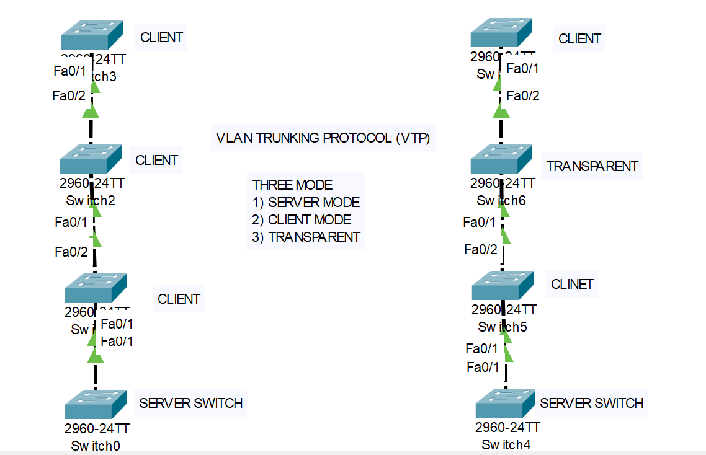

# Cisco VTP (VLAN Trunking Protocol) Lab



## 📌 Overview

This lab demonstrates the configuration and operation of **VLAN Trunking Protocol (VTP)** on Cisco Catalyst 2960 switches.

The topology demonstrates the three primary VTP modes:

- **VTP Server**
- **VTP Client**
- **VTP Transparent**

The purpose of the lab is to understand how VLAN information is created, propagated, and managed between switches using VTP.

---

## 🎯 Objectives

By completing this lab, the following concepts are demonstrated:

- Understand the purpose of VTP.
- Configure switches in different VTP modes.
- Configure a VTP Server.
- Configure VTP Clients.
- Configure a VTP Transparent switch.
- Configure trunk links between switches.
- Create VLANs on the VTP Server.
- Verify VLAN propagation to VTP Clients.
- Understand the behavior of VLANs in VTP Transparent mode.
- Verify VTP status and VLAN information using Cisco IOS commands.

---

## 🖥️ Technologies & Devices

| Component | Details |
|---|---|
| Network Simulator | Cisco Packet Tracer |
| Switch Model | Cisco Catalyst 2960-24TT |
| Protocol | VTP |
| VLAN Technology | IEEE 802.1Q |
| Switching | Layer 2 |
| VTP Modes | Server, Client, Transparent |

---

## 🗺️ Network Topology

The lab contains two VTP sections.

### Left-Side Topology

```text
                 CLIENT
               Switch3
                  |
                Fa0/2
                  |
                Fa0/1
                  |
               Switch2
               CLIENT
                  |
                Fa0/2
                  |
                Fa0/1
                  |
               Switch1
               CLIENT
                  |
                Fa0/1
                  |
             Switch0
          VTP SERVER
```

### Right-Side Topology

```text
                 CLIENT
               Switch7
                  |
                Fa0/2
                  |
                Fa0/1
                  |
               Switch6
            TRANSPARENT
                  |
                Fa0/2
                  |
                Fa0/1
                  |
               Switch5
               CLIENT
                  |
                Fa0/1
                  |
             Switch4
          VTP SERVER
```

> **Note:** The exact interface mapping should match the interfaces used in the Packet Tracer topology.

---

# 🔹 VTP Modes

## 1. VTP Server Mode

The VTP Server is responsible for creating, modifying, and deleting VLAN information within the VTP domain.

Typical responsibilities:

- Create VLANs.
- Delete VLANs.
- Modify VLAN information.
- Advertise VLAN information to VTP Clients.
- Maintain the VTP VLAN database.

Example:

```cisco
Switch(config)# vtp mode server
Switch(config)# vtp domain CCNA
Switch(config)# vtp password cisco
```

Create VLANs:

```cisco
Switch(config)# vlan 10
Switch(config-vlan)# name USERS
Switch(config-vlan)# exit

Switch(config)# vlan 20
Switch(config-vlan)# name MANAGEMENT
Switch(config-vlan)# exit

Switch(config)# vlan 30
Switch(config-vlan)# name SERVERS
Switch(config-vlan)# exit
```

---

# 🔹 VTP Client Mode

A VTP Client receives VLAN information from the VTP Server.

A client switch normally does not create or modify VLANs independently when operating under classic VTP behavior.

Example:

```cisco
Switch(config)# vtp mode client
Switch(config)# vtp domain CCNA
Switch(config)# vtp password cisco
```

Verify received VLANs:

```cisco
Switch# show vlan brief
```

---

# 🔹 VTP Transparent Mode

A VTP Transparent switch does not synchronize its VLAN database with the VTP Server in the same way as a VTP Client.

Instead, it maintains its VLAN configuration locally.

Example:

```cisco
Switch(config)# vtp mode transparent
Switch(config)# vtp domain CCNA
Switch(config)# vtp password cisco
```

VLANs can be created locally:

```cisco
Switch(config)# vlan 40
Switch(config-vlan)# name GUEST
Switch(config-vlan)# exit
```

---

# 🔗 Trunk Configuration

VTP advertisements require an appropriate trunking path between switches.

Configure the inter-switch links as trunks.

Example:

```cisco
Switch(config)# interface fa0/1
Switch(config-if)# switchport mode trunk
Switch(config-if)# no shutdown
Switch(config-if)# exit
```

If another inter-switch interface is used:

```cisco
Switch(config)# interface fa0/2
Switch(config-if)# switchport mode trunk
Switch(config-if)# no shutdown
Switch(config-if)# exit
```

Verify trunk status:

```cisco
Switch# show interfaces trunk
```

---

# ⚙️ VTP Configuration Workflow

A recommended configuration sequence is:

```text
1. Configure the VTP Server
        ↓
2. Configure VTP Domain
        ↓
3. Configure VTP Password
        ↓
4. Create VLANs on the Server
        ↓
5. Configure inter-switch links as Trunks
        ↓
6. Configure VTP Clients
        ↓
7. Configure Transparent Switch
        ↓
8. Verify VLAN propagation
        ↓
9. Verify VTP status
```

---

# 🧪 Verification Commands

## Check VTP Status

Run:

```cisco
show vtp status
```

Important information includes:

- VTP Operating Mode
- VTP Domain Name
- VTP Version
- Configuration Revision
- Maximum VLANs Supported
- Number of Existing VLANs

---

## Check VLAN Database

```cisco
show vlan brief
```

This command displays:

- VLAN ID
- VLAN Name
- VLAN Status
- Associated switch ports

---

## Check Trunk Links

```cisco
show interfaces trunk
```

This verifies:

- Trunk interfaces
- Encapsulation
- Native VLAN
- Allowed VLANs
- VLANs currently active on the trunk

---

## Check VTP Neighbors

```cisco
show vtp counters
```

This can be used to inspect VTP advertisement statistics.

---

## Check Running Configuration

```cisco
show running-config
```

This is useful for verifying:

- VTP mode
- VTP domain
- VTP password
- Trunk configuration
- VLAN configuration

---

# 🔍 Expected Results

After successful configuration:

### VTP Server

The Server should:

- Operate in **Server mode**.
- Belong to the configured VTP domain.
- Maintain the VLAN database.
- Advertise VLAN information through trunk links.

### VTP Clients

The Clients should:

- Operate in **Client mode**.
- Belong to the same VTP domain as the Server.
- Receive VLAN information from the VTP Server.
- Display the learned VLANs using:

```cisco
show vlan brief
```

### VTP Transparent Switch

The Transparent switch should:

- Operate in **Transparent mode**.
- Maintain VLAN information locally.
- Not behave like a VTP Client.
- Forward VTP advertisements through trunk links when applicable to the configured VTP version and topology.

---

# 📊 VTP Mode Comparison

| Feature | Server | Client | Transparent |
|---|---:|---:|---:|
| Create VLANs | ✅ | ❌ | ✅ Local |
| Delete VLANs | ✅ | ❌ | ✅ Local |
| Modify VLANs | ✅ | ❌ | ✅ Local |
| Maintains VLAN Database | ✅ | Receives | ✅ Local |
| Receives VTP Advertisements | ✅ | ✅ | Depends on VTP version/behavior |
| Synchronizes VLAN Database | — | ✅ | ❌ |
| VLAN Configuration | Centralized | Learned | Local |

---

# 🧠 Key Concepts Learned

## VTP Domain

A VTP domain identifies the group of switches that participate in the same VTP management domain.

Example:

```cisco
vtp domain CCNA
```

All switches that are intended to synchronize through VTP must have compatible VTP domain configuration.

---

## VTP Password

A VTP password can be configured to prevent switches with an incorrect password from participating in the intended VTP domain.

Example:

```cisco
vtp password cisco
```

---

## VTP Revision Number

VTP uses a configuration revision number to determine the current VLAN database version.

Check it using:

```cisco
show vtp status
```

A higher revision number can have significant consequences when switches join an existing VTP domain. Therefore, VTP configuration should be performed carefully.

---

## Trunk Links

VTP advertisements are exchanged over trunk connections.

Therefore, if VTP is not working as expected, verify the trunk configuration first:

```cisco
show interfaces trunk
```

---

# 🛠️ Troubleshooting

If VLAN information is not appearing on the VTP Client, check the following.

### 1. Verify VTP Mode

```cisco
show vtp status
```

Confirm that the intended switch is configured as:

```text
Server
Client
Transparent
```

---

### 2. Verify VTP Domain

```cisco
show vtp status
```

The domain must match where synchronization is expected.

---

### 3. Verify VTP Password

If a password is configured, verify that the participating switches use the correct password.

---

### 4. Verify Trunk Configuration

```cisco
show interfaces trunk
```

Make sure the inter-switch connection is operating as a trunk.

---

### 5. Verify VLANs on the Server

```cisco
show vlan brief
```

Confirm that the required VLANs actually exist on the VTP Server.

---

### 6. Check VTP Revision Number

```cisco
show vtp status
```

Pay particular attention to:

```text
Configuration Revision
```

Unexpected revision numbers can cause serious VLAN database issues in VTP environments.

---

# ⚠️ Important VTP Considerations

VTP can simplify VLAN administration, but it also introduces operational risk.

A switch with an unexpected VTP configuration or revision number can potentially affect the VLAN database of other switches in the same VTP domain.

For production networks:

- Understand VTP behavior before enabling it.
- Verify the VTP domain.
- Verify the VTP version.
- Verify the configuration revision number.
- Use VTP passwords where appropriate.
- Consider whether VTP is actually required.
- Document VLAN changes.

Modern network designs often prefer more controlled VLAN management rather than relying heavily on classic VTP behavior.

---

# 📁 Repository Structure

A recommended GitHub repository structure:

```text
VTP-Lab/
│
├── README.md
├── topology.png
│
├── configurations/
│   ├── switch0-server.txt
│   ├── switch1-client.txt
│   ├── switch2-client.txt
│   ├── switch3-client.txt
│   ├── switch4-server.txt
│   ├── switch5-client.txt
│   ├── switch6-transparent.txt
│   └── switch7-client.txt
│
└── packet-tracer/
    └── VTP-Lab.pkt
```

> Replace the filenames with your actual Packet Tracer and configuration filenames.

---

# 📸 Lab Topology

The topology demonstrates:

- Multiple Cisco 2960 switches
- VTP Server
- VTP Clients
- VTP Transparent switch
- Inter-switch connections
- VLAN propagation through the VTP environment

---

# ✅ Lab Checklist

- [x] Cisco 2960 switches added
- [x] VTP Server configured
- [x] VTP Clients configured
- [x] VTP Transparent mode configured
- [x] VTP domain configured
- [x] VTP password configured
- [x] VLANs created on Server
- [x] Trunk links configured
- [x] VLAN propagation verified
- [x] VTP status verified
- [x] VLAN database verified

---

# 🚀 How to Use This Lab

1. Open the Packet Tracer `.pkt` file.
2. Inspect the topology.
3. Configure the VTP Server.
4. Create the required VLANs.
5. Configure trunk links between switches.
6. Configure the Client switches.
7. Configure the Transparent switch.
8. Verify VTP status.
9. Verify VLAN propagation.
10. Test connectivity between devices belonging to the appropriate VLANs.

---

# 📚 Useful Cisco IOS Commands

```cisco
show vtp status
show vtp counters
show vlan brief
show interfaces trunk
show interfaces status
show running-config
show startup-config
```

---

# 🎓 Learning Outcome

This lab provides practical experience with **VLAN Trunking Protocol (VTP)** and demonstrates how VLAN information can be centrally managed and distributed across a switched network.

The lab also highlights the operational differences between:

```text
VTP Server
     │
     ├── VTP Client
     ├── VTP Client
     └── VTP Transparent
```

Understanding these differences is important when designing and troubleshooting Cisco switched networks.

---

## 👨‍💻 Author

**Chakresh Ram**

Cisco Networking | VLAN | VTP | Switching | Network Administration

---

## ⭐ Repository

If this lab helped you understand VTP, consider starring the repository.

**Topics:**  
`cisco` `packet-tracer` `vtp` `vlan` `switching` `networking` `ccna` `cisco-ios` `trunking`
