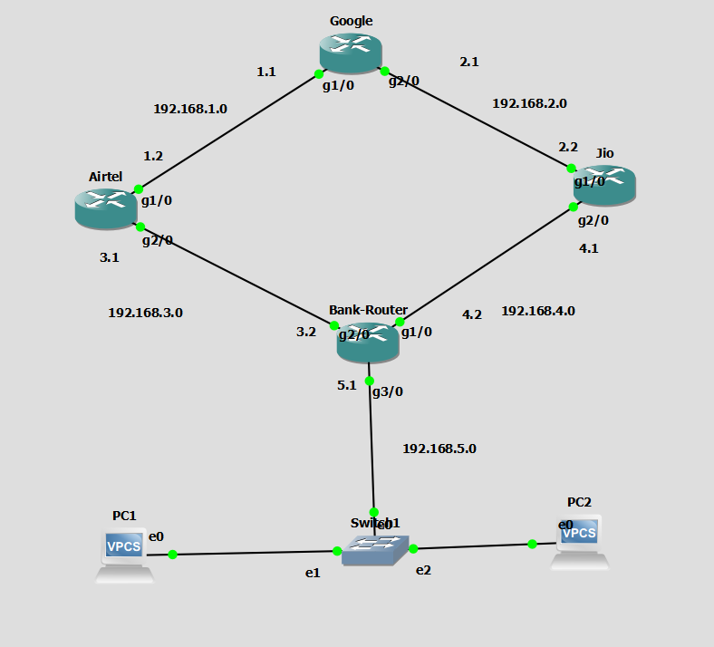

# GNS3 Static Routing + DHCP + Redundant Path Lab

## 📌 Project Overview

This project is a **GNS3 network simulation** that demonstrates:

- Router-to-router connectivity
- Static routing
- Primary and backup routes using **Administrative Distance (AD)**
- DHCP server configuration
- Automatic IP assignment to PCs
- DNS configuration
- Loopback interface
- End-to-end connectivity testing
- `ping` and `traceroute` troubleshooting
- Failover testing by shutting down router interfaces

The topology contains four routers:

- **Google**
- **Airtel**
- **Jio**
- **SBI-BANK / Bank-Router**

Two VPCS clients are connected to the SBI-BANK router.

---

## 🖥️ Topology



### Network Diagram

```text
                         Google
                    8.8.8.8 Loopback
                    /              \
          192.168.1.0/24        192.168.2.0/24
               /                      \
          Airtel                       Jio
       192.168.1.2                192.168.2.2
               \                      /
          192.168.3.0/24        192.168.4.0/24
                 \                /
                  \              /
                   SBI-BANK
                  /     | 
                 /      |
        192.168.5.0/24 |
              Switch
              /    \
            PC1    PC2
          .5.2     .5.3
```

---

# 1. IP Addressing Plan

| Device | Interface | IP Address | Network | Purpose |
|---|---|---|---|---|
| Google | G1/0 | `192.168.1.1/24` | `192.168.1.0/24` | Google ↔ Airtel |
| Airtel | G1/0 | `192.168.1.2/24` | `192.168.1.0/24` | Airtel ↔ Google |
| Google | G2/0 | `192.168.2.1/24` | `192.168.2.0/24` | Google ↔ Jio |
| Jio | G1/0 | `192.168.2.2/24` | `192.168.2.0/24` | Jio ↔ Google |
| Airtel | G2/0 | `192.168.3.1/24` | `192.168.3.0/24` | Airtel ↔ SBI-BANK |
| SBI-BANK | G2/0 | `192.168.3.2/24` | `192.168.3.0/24` | SBI-BANK ↔ Airtel |
| Jio | G2/0 | `192.168.4.1/24` | `192.168.4.0/24` | Jio ↔ SBI-BANK |
| SBI-BANK | G1/0 | `192.168.4.2/24` | `192.168.4.0/24` | SBI-BANK ↔ Jio |
| SBI-BANK | G3/0 | `192.168.5.1/24` | `192.168.5.0/24` | LAN / DHCP Gateway |
| Google | Loopback0 | `8.8.8.8/32` | `8.8.8.8/32` | Virtual destination |
| PC1 | e0 | `192.168.5.2/24` | `192.168.5.0/24` | DHCP client |
| PC2 | e0 | `192.168.5.3/24` | `192.168.5.0/24` | DHCP client |

---

# 2. Understanding the Topology

The network has two paths between SBI-BANK and Google.

### Primary path

```text
SBI-BANK → Jio → Google
```

Using:

```text
192.168.4.0/24
192.168.2.0/24
```

### Backup path

```text
SBI-BANK → Airtel → Google
```

Using:

```text
192.168.3.0/24
192.168.1.0/24
```

This gives the network redundancy.

If the Jio path fails, traffic can use Airtel.

---

# 3. Why `8.8.8.8` Is Used

This project does **not** connect to the real Google DNS server on the Internet.

Instead, `8.8.8.8` is configured as a **Loopback0 address on the Google router**:

```text
Google(config)# interface loopback 0
Google(config-if)# ip address 8.8.8.8 255.255.255.255
```

Therefore:

```text
8.8.8.8
```

represents a virtual destination inside the GNS3 topology.

This allows us to test routing without requiring a real Internet connection.

---

# 4. Configuring Google Router

## Interface G1/0

This interface connects Google to Airtel.

```text
Google# configure terminal
Google(config)# interface g1/0
Google(config-if)# ip address 192.168.1.1 255.255.255.0
Google(config-if)# no shutdown
```

### Explanation

- `interface g1/0` selects the interface.
- `ip address` assigns the IP address.
- `no shutdown` enables the interface.

---

## Interface G2/0

This interface connects Google to Jio.

```text
Google(config)# interface g2/0
Google(config-if)# ip address 192.168.2.1 255.255.255.0
Google(config-if)# no shutdown
```

---

## Loopback0

The loopback represents our virtual `8.8.8.8` destination.

```text
Google(config)# interface loopback 0
Google(config-if)# ip address 8.8.8.8 255.255.255.255
```

Because this is a `/32`, it represents exactly one IP address.

---

# 5. Google Static Routes

Google needs routes to the networks behind Airtel, Jio, and SBI-BANK.

### Route to Airtel-SBI network

```text
Google(config)# ip route 192.168.3.0 255.255.255.0 192.168.1.2
```

Meaning:

```text
To reach 192.168.3.0/24
send traffic to Airtel at 192.168.1.2
```

### Route to Jio-SBI network

```text
Google(config)# ip route 192.168.4.0 255.255.255.0 192.168.2.2
```

Meaning:

```text
To reach 192.168.4.0/24
send traffic to Jio at 192.168.2.2
```

---

# 6. Google Routes to the PC Network

Google needs to know how to reach:

```text
192.168.5.0/24
```

There are two possible paths.

### Primary route

```text
Google(config)# ip route 192.168.5.0 255.255.255.0 192.168.1.2 10
```

### Backup route

```text
Google(config)# ip route 192.168.5.0 255.255.255.0 192.168.2.2 20
```

Here:

- `10` = Administrative Distance
- `20` = Administrative Distance

The lower AD is preferred.

Therefore:

```text
Primary:
Google → Airtel → SBI-BANK

Backup:
Google → Jio → SBI-BANK
```

> The lab can also be designed with Jio as primary by assigning Jio AD `10` and Airtel AD `20`. The important concept is that the lower AD route is preferred.

---

# 7. Configuring Airtel Router

## G1/0

```text
Airtel# configure terminal
Airtel(config)# interface g1/0
Airtel(config-if)# ip address 192.168.1.2 255.255.255.0
Airtel(config-if)# no shutdown
```

This connects Airtel to Google.

## G2/0

```text
Airtel(config)# interface g2/0
Airtel(config-if)# ip address 192.168.3.1 255.255.255.0
Airtel(config-if)# no shutdown
```

This connects Airtel to SBI-BANK.

---

## Airtel Route to Google Loopback

```text
Airtel(config)# ip route 8.8.8.8 255.255.255.255 192.168.1.1
```

Meaning:

```text
8.8.8.8 → Google
Next hop = 192.168.1.1
```

---

## Airtel Route to LAN

```text
Airtel(config)# ip route 192.168.5.0 255.255.255.0 192.168.3.2
```

Meaning:

```text
192.168.5.0/24 → SBI-BANK
Next hop = 192.168.3.2
```

This route is important because replies from Google must eventually reach PC1/PC2.

---

# 8. Configuring Jio Router

## G1/0

```text
Jio# configure terminal
Jio(config)# interface g1/0
Jio(config-if)# ip address 192.168.2.2 255.255.255.0
Jio(config-if)# no shutdown
```

This connects Jio to Google.

## G2/0

```text
Jio(config)# interface g2/0
Jio(config-if)# ip address 192.168.4.1 255.255.255.0
Jio(config-if)# no shutdown
```

This connects Jio to SBI-BANK.

---

## Jio Route to Google

```text
Jio(config)# ip route 8.8.8.8 255.255.255.255 192.168.2.1
```

Meaning:

```text
8.8.8.8 → Google
Next hop = 192.168.2.1
```

---

## Jio Route to LAN

The correct subnet route is:

```text
Jio(config)# ip route 192.168.5.0 255.255.255.0 192.168.4.2
```

Meaning:

```text
192.168.5.0/24 → SBI-BANK
Next hop = 192.168.4.2
```

### Important

Do **not** use:

```text
ip route 192.168.5.0 255.255.255.255 192.168.4.2
```

because `255.255.255.255` is a `/32` host route.

For the complete PC network:

```text
192.168.5.0/24
```

use:

```text
255.255.255.0
```

---

# 9. Configuring SBI-BANK / Bank-Router

SBI-BANK connects to three networks:

```text
192.168.3.0/24 → Airtel
192.168.4.0/24 → Jio
192.168.5.0/24 → LAN
```

---

## G2/0 → Airtel

```text
Bank-Router# configure terminal
Bank-Router(config)# interface g2/0
Bank-Router(config-if)# ip address 192.168.3.2 255.255.255.0
Bank-Router(config-if)# no shutdown
```

---

## G1/0 → Jio

```text
Bank-Router(config)# interface g1/0
Bank-Router(config-if)# ip address 192.168.4.2 255.255.255.0
Bank-Router(config-if)# no shutdown
```

---

## G3/0 → LAN

```text
Bank-Router(config)# interface g3/0
Bank-Router(config-if)# ip address 192.168.5.1 255.255.255.0
Bank-Router(config-if)# no shutdown
```

This address becomes the default gateway for PC1 and PC2.

---

# 10. DHCP Configuration

SBI-BANK is also acting as a DHCP server.

```text
Bank-Router(config)# ip dhcp pool SBI-BANK
Bank-Router(dhcp-config)# network 192.168.5.0 255.255.255.0
Bank-Router(dhcp-config)# default-router 192.168.5.1
Bank-Router(dhcp-config)# dns-server 8.8.8.8
```

### What each command does

| Command | Purpose |
|---|---|
| `ip dhcp pool SBI-BANK` | Creates DHCP pool |
| `network 192.168.5.0 255.255.255.0` | Defines client network |
| `default-router 192.168.5.1` | Gives clients their gateway |
| `dns-server 8.8.8.8` | Gives clients a DNS server |

---

# 11. DHCP Result on PC1

PC1 successfully received:

```text
IP Address : 192.168.5.2
Mask       : 255.255.255.0
Gateway    : 192.168.5.1
```

The command:

```text
PC1> ip dhcp
```

returned:

```text
DDORA IP 192.168.5.2/24 GW 192.168.5.1
```

This confirms that DHCP is working.

---

# 12. DHCP Result on PC2

PC2 received:

```text
IP Address : 192.168.5.3
Mask       : 255.255.255.0
Gateway    : 192.168.5.1
```

This was obtained using:

```text
PC2> ip dhcp
```

Result:

```text
DDORA IP 192.168.5.3/24 GW 192.168.5.1
```

---

# 13. What Is DORA?

DHCP uses four main steps:

```text
D → Discover
O → Offer
R → Request
A → Acknowledgment
```

### DHCP Discover

The PC broadcasts:

```text
"Is there a DHCP server?"
```

### DHCP Offer

The DHCP server offers an IP address.

Example:

```text
192.168.5.2
```

### DHCP Request

The client requests the offered address.

### DHCP Acknowledgment

The server confirms the lease.

The result is:

```text
PC1
 ↓
DHCP Discover
 ↓
SBI-BANK
 ↓
DHCP Offer
 ↓
PC1
 ↓
DHCP Request
 ↓
SBI-BANK
 ↓
DHCP ACK
 ↓
PC1 gets 192.168.5.2
```

---

# 14. Default Routes on SBI-BANK

SBI-BANK has two default routes.

### Primary

```text
Bank-Router(config)# ip route 0.0.0.0 0.0.0.0 192.168.4.1 10
```

### Backup

```text
Bank-Router(config)# ip route 0.0.0.0 0.0.0.0 192.168.3.1 20
```

The router chooses:

```text
AD 10
```

before:

```text
AD 20
```

Therefore the normal path is:

```text
PC
 ↓
SBI-BANK
 ↓
Jio
 ↓
Google
```

If Jio fails:

```text
PC
 ↓
SBI-BANK
 ↓
Airtel
 ↓
Google
```

---

# 15. Understanding Administrative Distance

Administrative Distance tells the router which route source is more trustworthy.

For static routes:

```text
Lower AD = Better route
```

Example:

```text
Route A → AD 10
Route B → AD 20
```

The router selects:

```text
Route A
```

If Route A becomes unavailable, Route B can be used.

This is called a **floating static route** when the backup static route is configured with a higher AD.

---

# 16. Testing from SBI-BANK

The following command was successful:

```text
Bank-Router# ping 8.8.8.8
```

Result:

```text
!!!!!
Success rate is 100 percent
```

This proves:

```text
SBI-BANK → Google
```

is working.

---

# 17. Testing with Traceroute

The command:

```text
Bank-Router# trace 8.8.8.8
```

showed:

```text
1  192.168.4.1
2  192.168.2.1
```

This means the normal path was:

```text
SBI-BANK
    ↓
Jio 192.168.4.1
    ↓
Google 192.168.2.1
    ↓
8.8.8.8
```

---

# 18. Testing PC1

PC1 received:

```text
192.168.5.2/24
```

Then:

```text
PC1> ping 8.8.8.8
```

Successful result:

```text
84 bytes from 8.8.8.8 icmp_seq=1 ttl=253
84 bytes from 8.8.8.8 icmp_seq=2 ttl=253
84 bytes from 8.8.8.8 icmp_seq=3 ttl=253
84 bytes from 8.8.8.8 icmp_seq=4 ttl=253
84 bytes from 8.8.8.8 icmp_seq=5 ttl=253
```

This confirms:

```text
PC1
 ↓
SBI-BANK
 ↓
Router path
 ↓
Google
 ↓
8.8.8.8
```

is working.

---

# 19. Why Traceroute Sometimes Shows `* * *`

You may see:

```text
PC1> trace 8.8.8.8

1   192.168.5.1
2   * * *
3   * * *
```

This does **not automatically mean routing is broken**.

Routers may not return the ICMP response that VPCS expects for every traceroute probe.

In this lab, you also observed:

```text
ICMP type:3, code:3, Destination port unreachable
```

This means:

```text
Type 3 = Destination Unreachable
Code 3 = Port Unreachable
```

Because `8.8.8.8` is a Loopback address and not a real application server, the UDP-based traceroute probe can reach the destination and receive a port-unreachable response.

Therefore, in this lab:

```text
ping 8.8.8.8
```

is the more important end-to-end connectivity test.

---

# 20. Failover Testing

One of the main goals of this topology is to test redundancy.

## Test Jio failure

On SBI-BANK:

```text
Bank-Router# configure terminal
Bank-Router(config)# interface g1/0
Bank-Router(config-if)# shutdown
```

This disables the Jio link.

The primary route:

```text
SBI-BANK → Jio → Google
```

becomes unavailable.

The backup route through Airtel should then be selected:

```text
SBI-BANK → Airtel → Google
```

Test:

```text
Bank-Router# do ping 8.8.8.8
```

and from PC1:

```text
PC1> ping 8.8.8.8
```

---

# 21. Verify the Backup Route

After shutting down G1/0 on SBI-BANK:

```text
Bank-Router# do show ip route
```

The default route should change from:

```text
S* 0.0.0.0/0 [10/0] via 192.168.4.1
```

to:

```text
S* 0.0.0.0/0 [20/0] via 192.168.3.1
```

This proves that the floating static route is working.

---

# 22. Restore the Primary Link

After testing failover:

```text
Bank-Router# configure terminal
Bank-Router(config)# interface g1/0
Bank-Router(config-if)# no shutdown
```

The primary route should become active again:

```text
S* 0.0.0.0/0 [10/0] via 192.168.4.1
```

---

# 23. Useful Verification Commands

## Check interfaces

```text
show ip interface brief
```

If you are in configuration mode, use:

```text
do show ip interface brief
```

Look for:

```text
Status = up
Protocol = up
```

---

## Check routing table

```text
show ip route
```

From configuration mode:

```text
do show ip route
```

---

## Check a specific route

```text
show ip route 192.168.5.0
```

---

## Check configuration

```text
show running-config
```

or:

```text
do show running-config
```

---

## Check static routes only

```text
show running-config | section ip route
```

or:

```text
do show running-config | section ip route
```

---

## Test connectivity

```text
ping 8.8.8.8
```

---

## Trace path

```text
trace 8.8.8.8
```

---

# 24. Saving Configuration

Cisco IOS configuration exists in two important places:

```text
Running Configuration
        ↓
Startup Configuration
```

To save the current configuration:

```text
write
```

or:

```text
copy running-config startup-config
```

In this project:

```text
do write
```

was used while inside configuration mode.

For VPCS:

```text
PC1> save
PC2> save
```

This saves the VPCS configuration.

---

# 25. Common CLI Mistakes

## Mistake 1 — Using `show` inside configuration mode

Wrong:

```text
Router(config)# show ip route
```

Correct:

```text
Router(config)# do show ip route
```

Or exit configuration mode first:

```text
Router(config)# end
Router# show ip route
```

---

## Mistake 2 — Using `ping` inside configuration mode

Wrong:

```text
Router(config)# ping 8.8.8.8
```

Correct:

```text
Router(config)# do ping 8.8.8.8
```

---

## Mistake 3 — Wrong route mask

Wrong:

```text
ip route 192.168.5.0 255.255.255.255 192.168.4.2
```

This creates a `/32` route.

Correct:

```text
ip route 192.168.5.0 255.255.255.0 192.168.4.2
```

This creates a `/24` route for the complete LAN.

---

## Mistake 4 — Using `ip add` outside interface configuration

Wrong:

```text
Jio(config)# ip address 192.168.2.2 255.255.255.0
```

Correct:

```text
Jio(config)# interface g1/0
Jio(config-if)# ip address 192.168.2.2 255.255.255.0
```

---

## Mistake 5 — Forgetting `no shutdown`

An interface can have an IP address but still be administratively down.

Use:

```text
no shutdown
```

Then verify:

```text
show ip interface brief
```

---

# 26. Complete Routing Logic

The complete routing logic is:

```text
                         Google
                    8.8.8.8 Loopback
                    /              \
             Airtel                  Jio
          192.168.1.2            192.168.2.2
               |                      |
          192.168.3.1            192.168.4.1
               |                      |
               +-------- SBI-BANK ----+
                          |
                    192.168.5.1
                       /     \
                    PC1      PC2
                  .5.2       .5.3
```

### Normal traffic

```text
PC1
 ↓
SBI-BANK
 ↓
Jio/Airtel according to route AD
 ↓
Google
 ↓
8.8.8.8
```

### Return traffic

```text
8.8.8.8
 ↓
Google
 ↓
Airtel/Jio according to route AD
 ↓
SBI-BANK
 ↓
PC1
```

Both directions need valid routes.

---

# 27. What Was Demonstrated

This project demonstrates the following networking concepts:

| Concept | Demonstrated |
|---|---|
| IPv4 addressing | ✅ |
| Subnetting | ✅ |
| Router interfaces | ✅ |
| Static routing | ✅ |
| Default route | ✅ |
| Floating static route | ✅ |
| Administrative Distance | ✅ |
| Redundant paths | ✅ |
| DHCP | ✅ |
| DHCP DORA | ✅ |
| DNS configuration | ✅ |
| Loopback interface | ✅ |
| Ping testing | ✅ |
| Traceroute testing | ✅ |
| Failover testing | ✅ |
| GNS3 VPCS | ✅ |
| Cisco IOS CLI | ✅ |

---

# 28. Final Verification

### PC1

```text
PC1> show ip
```

Expected:

```text
IP/MASK : 192.168.5.2/24
GATEWAY : 192.168.5.1
DNS     : 8.8.8.8
```

### PC2

```text
PC2> show ip
```

Expected:

```text
IP/MASK : 192.168.5.3/24
GATEWAY : 192.168.5.1
DNS     : 8.8.8.8
```

### Connectivity

```text
PC1> ping 192.168.5.1
PC1> ping 8.8.8.8
```

Expected:

```text
!!!!!
```

### Router connectivity

```text
Bank-Router# ping 8.8.8.8
```

Expected:

```text
!!!!!
```

---

# 29. Key Learning

The most important lesson from this lab is that **routing must work in both directions**.

It is not enough for:

```text
PC1 → Google
```

to have a valid path.

Google must also know how to return:

```text
Google → PC1
```

Similarly, every intermediate router must know where the destination network is located.

The final working design uses:

- Static routes for reachability
- Administrative Distance for path selection
- A floating static route for redundancy
- DHCP for automatic client configuration
- A loopback interface to simulate a destination
- Ping for connectivity verification
- Traceroute for path analysis

---

# 30. Author

**Chakresh Ram Kudupudi**

Cybersecurity | Networking | GNS3 | Cisco IOS

---

## 📁 Suggested Repository Structure

```text
gns3-static-routing-dhcp-lab/
│
├── README.md
│
├── images/
│   ├── topology.png
│   ├── pc1-dhcp.png
│   ├── pc2-dhcp.png
│   ├── pc1-ping.png
│   ├── traceroute.png
│   └── failover.png
│
└── configs/
    ├── google.txt
    ├── airtel.txt
    ├── jio.txt
    └── sbi-bank.txt
```

> Replace the image filenames above with your actual screenshot filenames before pushing the repository to GitHub.
