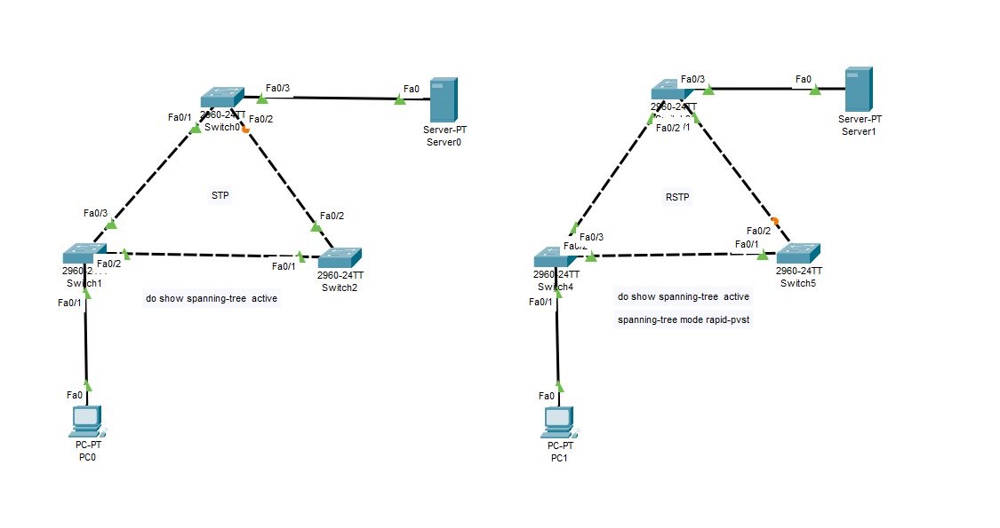

# 🌐 Lab 9: Spanning Tree Protocol (STP) vs Rapid Spanning Tree Protocol (RSTP) Lab

Welcome to **Lab 9: Spanning Tree Protocol (STP) vs Rapid Spanning Tree Protocol (RSTP) Lab** configured in **Cisco Packet Tracer**! This lab provides a hands-on architectural comparison between traditional **IEEE 802.1D Spanning Tree Protocol (STP / PVST+)** and modern **IEEE 802.1w Rapid Spanning Tree Protocol (RSTP / Rapid-PVST+)** across redundant Layer 2 switch topologies.

---

## 📸 Topology Diagram



---

## 🎯 Lab Objectives

1. **Understand Layer 2 Loop Hazards**: Analyze why physical redundancy causes **Broadcast Storms**, **MAC Table Instability**, and **Multiple Frame Deliveries** in Ethernet networks without Spanning Tree.
2. **Traditional STP Configuration (802.1D / PVST+)**: Configure standard timer-based Spanning Tree Protocol on Cisco Catalyst 2960 switches.
3. **Rapid STP Configuration (802.1w / Rapid-PVST+)**: Transition switches to Rapid-PVST+ using `spanning-tree mode rapid-pvst`.
4. **Compare Port Roles & States**:
   - Compare STP roles (Root Port, Designated Port, Blocking Port) with RSTP roles (Root Port, Designated Port, Alternate Port, Backup Port).
   - Examine RSTP port state simplification (Discarding, Learning, Forwarding).
5. **Convergence Time Benchmark**: Demonstrate the shift from **30–50 second timer-based STP convergence** to **sub-second / 1–2 second RSTP handshake convergence**.
6. **Evaluate Advantages & Disadvantages**: Comprehensive evaluation of STP vs RSTP for enterprise network design.

---

## 🛠️ Network Addressing & Topology Architecture

### 1️⃣ Traditional STP Topology (Left Side)

| Device | Model | Interface | Connected Device / Port | Role | STP Port State |
| :--- | :--- | :--- | :--- | :--- | :--- |
| **Switch0** | Catalyst 2960-24TT | `Fa0/1` | `Switch1` (`Fa0/3`) | Root Port (RP) | Forwarding (FWD) |
| | | `Fa0/2` | `Switch2` (`Fa0/2`) | Non-Designated / Blocking | Blocking (BLK 🟠) |
| | | `Fa0/3` | `Server0` (`Fa0`) | Designated Port (DP) | Forwarding (FWD) |
| **Switch1** | Catalyst 2960-24TT | `Fa0/1` | `PC0` (`Fa0`) | Designated Port (DP) | Forwarding (FWD) |
| | | `Fa0/2` | `Switch2` (`Fa0/1`) | Designated Port (DP) | Forwarding (FWD) |
| | | `Fa0/3` | `Switch0` (`Fa0/1`) | Designated Port (DP) | Forwarding (FWD) |
| **Switch2** | Catalyst 2960-24TT | `Fa0/1` | `Switch1` (`Fa0/2`) | Root Port (RP) | Forwarding (FWD) |
| | | `Fa0/2` | `Switch0` (`Fa0/2`) | Designated Port (DP) | Forwarding (FWD) |
| **PC0** | VPCS / End Host | `Fa0` | `Switch1` (`Fa0/1`) | Client Host | Connected |
| **Server0** | Server Host | `Fa0` | `Switch0` (`Fa0/3`) | Application Server | Connected |

---

### 2️⃣ Rapid STP (RSTP) Topology (Right Side)

| Device | Model | Interface | Connected Device / Port | Role | RSTP Port State |
| :--- | :--- | :--- | :--- | :--- | :--- |
| **Switch3** | Catalyst 2960-24TT | `Fa0/1` | `Switch4` (`Fa0/3`) | Root Port (RP) | Forwarding (FWD) |
| | | `Fa0/2` | `Switch5` (`Fa0/1`) | Designated Port (DP) | Forwarding (FWD) |
| | | `Fa0/3` | `Server1` (`Fa0`) | Designated Port (DP) | Forwarding (FWD) |
| **Switch4** | Catalyst 2960-24TT | `Fa0/1` | `PC1` (`Fa0`) | Edge / Designated Port | Forwarding (FWD) |
| | | `Fa0/2` | `Switch5` (`Fa0/1`) | Designated Port (DP) | Forwarding (FWD) |
| | | `Fa0/3` | `Switch3` (`Fa0/1`) | Designated Port (DP) | Forwarding (FWD) |
| **Switch5** | Catalyst 2960-24TT | `Fa0/1` | `Switch4` (`Fa0/2`) | Root Port (RP) | Forwarding (FWD) |
| | | `Fa0/2` | `Switch3` (`Fa0/2`) | Alternate Port (AP) | Discarding (BLK 🟠) |
| **PC1** | VPCS / End Host | `Fa0` | `Switch4` (`Fa0/1`) | Client Host | Connected |
| **Server1** | Server Host | `Fa0` | `Switch3` (`Fa0/3`) | Application Server | Connected |

---

## 🧠 Technical Comparison: STP (802.1D) vs RSTP (802.1w)

### 1. Root Bridge Selection Mechanism
Both STP and RSTP elect a **Root Bridge** using the lowest **Bridge ID (BID)**:
$$\text{Bridge ID (BID)} = \text{Bridge Priority} + \text{System ID Extension (VLAN ID)} + \text{MAC Address}$$
- Default Priority: `32768` (Plus VLAN 1 = `32769`).
- The switch with the lowest priority (or lowest MAC address in a tie) becomes the Root Bridge. All ports on the Root Bridge are **Designated Ports (Forwarding)**.

---

### 2. Port Roles Comparison

| Protocol | Root Port (RP) | Designated Port (DP) | Alternate Port (AP) | Backup Port (BP) | Blocking / Non-Designated |
| :--- | :--- | :--- | :--- | :--- | :--- |
| **STP (802.1D)** | Best path to Root Bridge | Best path per segment | N/A (Grouped as Blocking) | N/A (Grouped as Blocking) | Discards data frames to break loops |
| **RSTP (802.1w)** | Best path to Root Bridge | Best path per segment | Immediate backup to Root Port | Immediate backup to Designated Port | N/A (Consolidated into Alternate/Backup) |

---

### 3. Port States & Convergence Speed

```text
STP (802.1D):    Blocking (20s) ──> Listening (15s) ──> Learning (15s) ──> Forwarding (30-50 sec Total)
                                                                            
RSTP (802.1w):   Discarding ────────> Proposal/Agreement Handshake ─────────> Forwarding (1-2 sec Total)
```

| Port State | STP (802.1D) | RSTP (802.1w) | Processes BPDUs? | Learns MAC Addresses? | Forwards Data Frames? |
| :--- | :---: | :---: | :---: | :---: | :---: |
| **Disabled** | ✅ Yes | ❌ (Consolidated to Discarding) | ❌ No | ❌ No | ❌ No |
| **Blocking / Alternate** | ✅ Yes | ❌ (Consolidated to Discarding) | ✅ Yes | ❌ No | ❌ No |
| **Listening** | ✅ Yes | ❌ (Consolidated to Discarding) | ✅ Yes | ❌ No | ❌ No |
| **Learning** | ✅ Yes | ✅ Yes | ✅ Yes | ✅ Yes | ❌ No |
| **Forwarding** | ✅ Yes | ✅ Yes | ✅ Yes | ✅ Yes | ✅ Yes |

---

## ⚖️ Advantages and Disadvantages

### 🔹 Spanning Tree Protocol (STP - IEEE 802.1D / PVST+)

#### ✅ Advantages of STP
1. **Loop Elimination & Safety**: Prevents network-wide outages caused by broadcast storms and MAC table flapping in redundant topologies.
2. **Universal Vendor Compatibility**: Native support across virtually all network switches and legacy networking hardware.
3. **Low Hardware Resource Overhead**: Simple state machine requires minimal CPU and memory processing power.
4. **Automated Path Redundancy**: Automatically opens backup links when an active link fails, requiring no human intervention.

#### ❌ Disadvantages of STP
1. **Extremely Slow Convergence (30–50 Seconds)**: Default timers require 20s Max Age + 15s Listening + 15s Learning before forwarding data.
2. **Network Service Disruption**: Active TCP sessions, VoIP calls, and video streams disconnect during link failures due to long failover delays.
3. **Overly Complex 5-State Model**: Tracking five distinct port states increases operational troubleshooting complexity.
4. **Rigid Timer Reliance**: Relies on passive timer expiration rather than active switch-to-switch negotiation.

---

### 🔹 Rapid Spanning Tree Protocol (RSTP - IEEE 802.1w / Rapid-PVST+)

#### ✅ Advantages of RSTP
1. **Sub-Second / High-Speed Convergence**: Transitions ports to Forwarding in **under 1 to 2 seconds** via direct Proposal/Agreement handshakes.
2. **Seamless Backward Compatibility**: Automatically falls back to 802.1D compatibility mode when connected to legacy 802.1D switches.
3. **Simplified 3-State Model**: Streamlines port states into **Discarding**, **Learning**, and **Forwarding**.
4. **Pre-Computed Backup Paths**: Defines **Alternate Ports (AP)** and **Backup Ports (BP)** for instantaneous switchover without re-running full calculations.
5. **Edge Port Fast-Forwarding (PortFast)**: Allows end-host ports (`PC`, `Server`, `Printer`) to enter Forwarding state immediately without triggering Topology Change Notifications (TCNs).

#### ❌ Disadvantages of RSTP
1. **Higher CPU & Control Plane Overhead**: All switches send BPDUs every Hello interval (2s), increasing CPU load compared to STP (where only the Root Bridge originates BPDUs).
2. **Point-to-Point Full-Duplex Dependency**: Rapid convergence requires full-duplex point-to-point links; falls back to slow timer-based convergence on half-duplex shared links.
3. **Resource Scaling in Large Multi-VLAN Networks (Rapid-PVST+)**: Running an independent RSTP instance per VLAN increases memory consumption on switches with hundreds of configured VLANs.

---

## ⚙️ Cisco IOS Configuration Commands

### 🔹 1. Enable Rapid-PVST+ (RSTP)
```cisco
Switch# configure terminal
Switch(config)# spanning-tree mode rapid-pvst
```

### 🔹 2. Configure Primary & Secondary Root Bridge
```cisco
! Set Switch as Primary Root Bridge for VLAN 1 (Priority 24576)
Switch(config)# spanning-tree vlan 1 root primary

! Set Switch as Secondary Root Bridge for VLAN 1 (Priority 28672)
Switch(config)# spanning-tree vlan 1 root secondary

! Alternatively set explicit priority (Must be multiple of 4096)
Switch(config)# spanning-tree vlan 1 priority 4096
```

### 🔹 3. Configure PortFast & BPDU Guard on Edge Ports
```cisco
! Enable PortFast on an access interface (Instant Forwarding for PC/Server)
Switch(config)# interface FastEthernet 0/1
Switch(config-if)# spanning-tree portfast
Switch(config-if)# spanning-tree bpduguard enable
Switch(config-if)# exit

! Enable PortFast globally for all access interfaces
Switch(config)# spanning-tree portfast default
```

---

## 🔍 Verification & Inspection Commands

Execute these Cisco IOS commands to inspect Spanning Tree operation:

```cisco
# 1. View active Spanning Tree topology details
Switch# show spanning-tree active

# 2. Inspect Spanning Tree state for VLAN 1
Switch# show spanning-tree vlan 1

# 3. View high-level Spanning Tree summary and active mode
Switch# show spanning-tree summary

# 4. View detailed status of a specific interface
Switch# show spanning-tree interface FastEthernet 0/1
```

---

## 👤 Author & Repository

- **Repository**: [Networking Labs](https://github.com/chakreshram11/Networking-Labs)
- **Author**: Kudupudi Chakresh Ram (`chakreshram11`)
