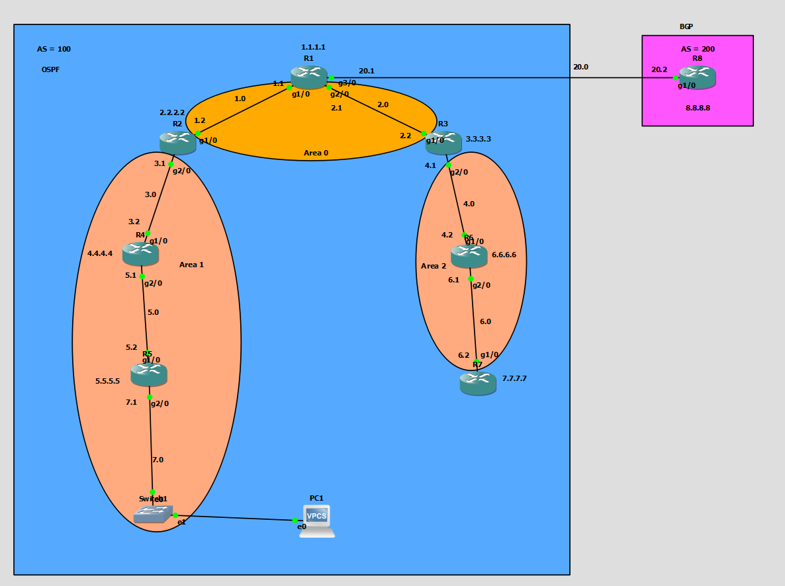

# 🌐 Lab 7: Multi-Area OSPF & eBGP Redistribution Lab

Welcome to **Lab 7: Multi-Area OSPF & eBGP Redistribution**. This GNS3 lab simulates an enterprise network with a Multi-Area OSPF core (Area 0, Area 1, Area 2), two Area Border Routers (ABRs), an Autonomous System Border Router (ASBR) with eBGP peering to an external ISP network (AS 200), mutual route redistribution, and an integrated DHCP server.

---

## 📐 Network Topology & Architecture



### 🔹 Autonomous Systems & OSPF Areas
- **OSPF Domain (Process ID 110)**:
  - **Area 0 (Backbone)**: `R1`, `R2`, `R3` (Interconnects `192.168.1.0/24` and `192.168.2.0/24`)
  - **Area 1**: `R2`, `R4`, `R5` (Subnets `192.168.3.0/24`, `192.168.5.0/24`, `192.168.7.0/24`)
  - **Area 2**: `R3`, `R6`, `R7` (Subnets `192.168.4.0/24`, `192.168.6.0/24`)
- **BGP Domain**:
  - **AS 100**: Router `R1` (Local ASBR)
  - **AS 200**: Router `R8` (External ISP / Remote AS)
  - **eBGP Peering Link**: `192.168.20.0/24` between `R1` (`192.168.20.1`) and `R8` (`192.168.20.2`)

### 🔹 Key Device Roles
| Device | Role | IP / Interfaces | Routing Protocols |
|---|---|---|---|
| **R1** | ASBR / Area 0 Router | `1.1.1.1/32` (Lo0), `192.168.1.1` (Fa0/0), `192.168.2.1` (Fa0/1), `192.168.20.1` (Fa1/0) | OSPF 110 (Area 0), BGP 100 (eBGP to R8), Mutual Redistribution |
| **R2** | ABR (Area 0 ↔ Area 1) | `2.2.2.2/32` (Lo0), `192.168.1.2` (Fa0/0), `192.168.3.1` (Fa0/1) | OSPF 110 (Area 0, Area 1) |
| **R3** | ABR (Area 0 ↔ Area 2) | `3.3.3.3/32` (Lo0), `192.168.2.2` (Fa0/0), `192.168.4.1` (Fa0/1) | OSPF 110 (Area 0, Area 2) |
| **R4** | Area 1 Internal Router | `4.4.4.4/32` (Lo0), `192.168.3.2` (Fa0/0), `192.168.5.1` (Fa0/1) | OSPF 110 (Area 1) |
| **R5** | Area 1 Internal Router & DHCP Server | `5.5.5.5/32` (Lo0), `192.168.5.2` (Fa0/0), `192.168.7.1` (Fa0/1) | OSPF 110 (Area 1), Cisco IOS DHCP (`ospf-pool`) |
| **R6** | Area 2 Internal Router | `6.6.6.6/32` (Lo0), `192.168.4.2` (Fa0/0), `192.168.6.1` (Fa0/1) | OSPF 110 (Area 2) |
| **R7** | Area 2 Internal Router | `7.7.7.7/32` (Lo0), `192.168.6.2` (Fa0/0) | OSPF 110 (Area 2) |
| **R8** | ISP / External BGP Peer | `8.8.8.8/32` (Lo0), `192.168.20.2` (Fa0/0) | BGP 200 (eBGP to R1) |
| **PC1**| Client Host | Dynamic DHCP (`192.168.7.0/24`) | Default Gateway `192.168.7.1` (R5) |

---

## 🎯 Lab Objectives & Key Configurations

1. **Multi-Area OSPF Hierarchy**:
   - Establish Area 0 as the central backbone.
   - Configure Area 1 (`R2`, `R4`, `R5`) and Area 2 (`R3`, `R6`, `R7`) attached via ABRs (`R2` and `R3`).
2. **eBGP Peering & ISP Network Simulation**:
   - Configure eBGP between AS 100 (`R1`) and AS 200 (`R8`).
   - Advertise public prefix `8.8.8.8/32` from `R8` into BGP.
3. **Two-Way Route Redistribution on ASBR (`R1`)**:
   - Inject BGP routes into OSPF (`redistribute bgp 100 subnets` under OSPF 110).
   - Inject OSPF internal & inter-area routes into BGP (`redistribute ospf 110` under BGP 100).
4. **Dynamic IP Assignment via Cisco IOS DHCP**:
   - Enable DHCP server pool `ospf-pool` on `R5` for `192.168.7.0/24`.
5. **End-to-End Connectivity Verification**:
   - Ensure clients in Area 1 / Area 2 and routers `R1`-`R7` can ping `8.8.8.8` (Remote BGP destination across AS boundary).

---

## 🧪 Verification Commands

```bash
# Check OSPF Neighbors and Adjacencies
R1# show ip ospf neighbor

# Check OSPF Routing Table and Inter-Area / External Routes (O E2)
R4# show ip route ospf

# Check BGP Summary & Neighbors on ASBR (R1) and ISP (R8)
R1# show ip bgp summary
R8# show ip bgp

# Test End-to-End Reachability to Remote ISP Destination
R5# ping 8.8.8.8
R7# ping 8.8.8.8
```

---

## 📁 Repository Path
- Topology file: `Seventh_Lab_OSPF&BGP/Multi-Area-OSPF-eBGP-Redistribution-Lab.gns3`
- Config files: `Seventh_Lab_OSPF&BGP/project-files/dynamips/`
- Topology Image: `Seventh_Lab_OSPF&BGP/images/topology.png`
