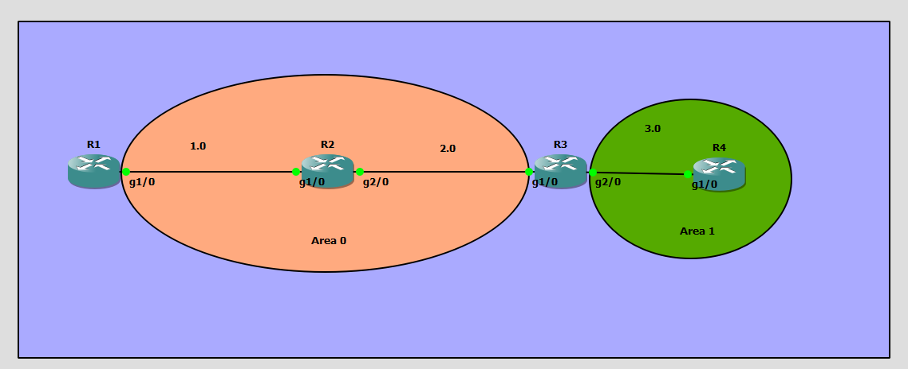
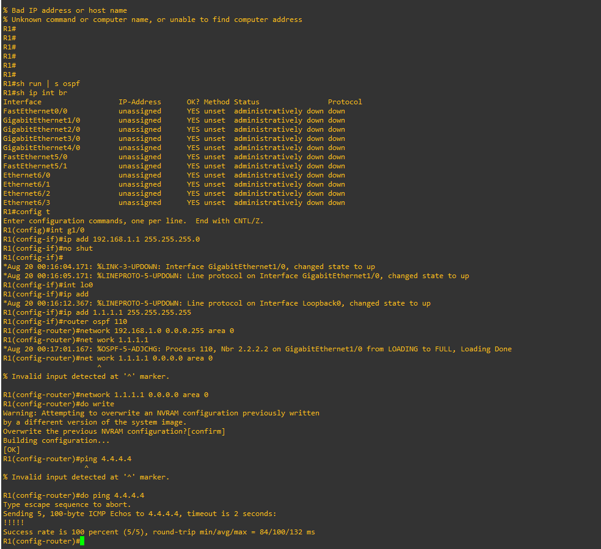
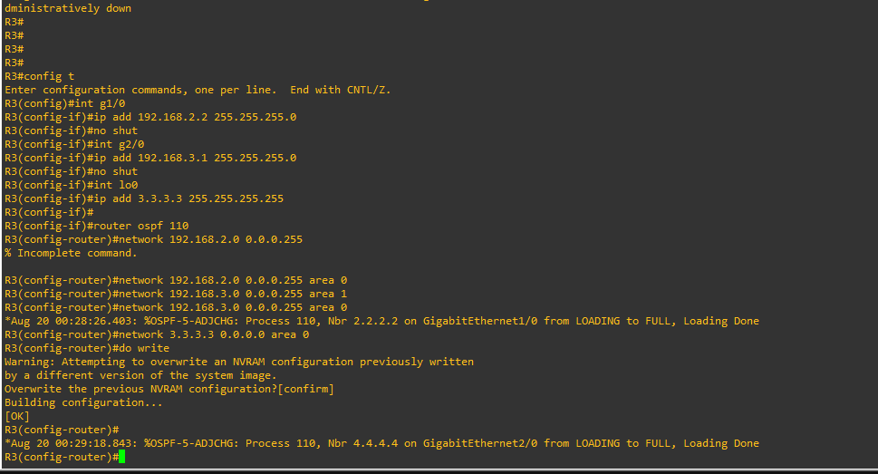
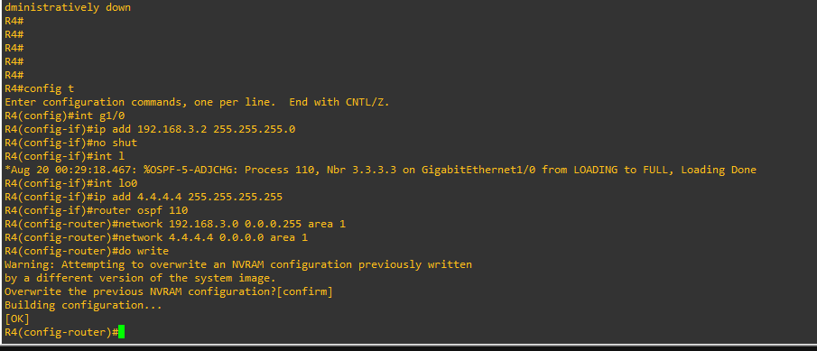
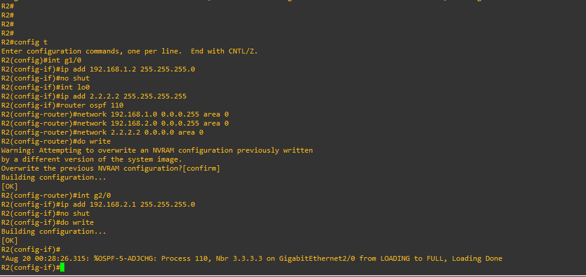
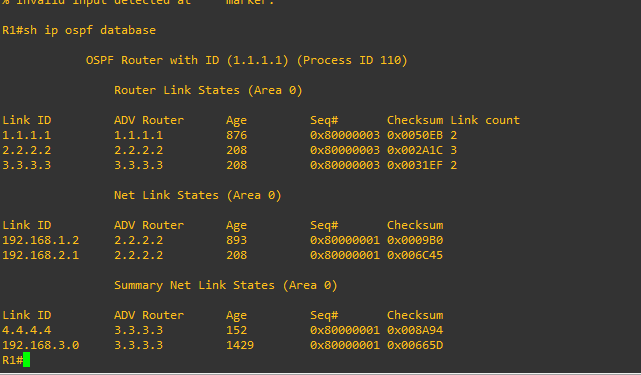

# GNS3 Multi-Area OSPF (Open Shortest Path First) Dynamic Routing Lab

## 📌 Project Overview

This project is a **GNS3 enterprise network simulation** demonstrating the design, configuration, and verification of **Multi-Area OSPF (Open Shortest Path First)** dynamic routing across Cisco IOS routers. 

Unlike Single-Area OSPF where all routers reside in Area 0, Multi-Area OSPF introduces a hierarchical network structure to optimize routing efficiency, reduce SPF algorithm computation overhead, limit LSA flooding scope, and minimize routing table size in large-scale networks.

### Key Concepts & Features Demonstrated
- **Hierarchical Multi-Area OSPF Architecture** (Backbone `Area 0` and Standard `Area 1`)
- **OSPF Router Roles**:
  - **Internal Routers (IR)**: `R1` and `R2` in Area 0; `R4` in Area 1.
  - **Area Border Router (ABR)**: `R3` traversing both Area 0 (`g1/0`) and Area 1 (`g2/0`).
- **LSA Types & Inter-Area Summarization**:
  - **Type 1 (Router LSA)** & **Type 2 (Network LSA)** for intra-area routing.
  - **Type 3 (Summary Net Link States)** generated by ABR `R3` to advertise networks between Area 1 and Area 0.
- **Loopback Interface Configuration** (`Loopback0`) for deterministic OSPF Router ID selection and host reachability simulation.
- **Wildcard Masking** (`0.0.0.255` for `/24` subnets, `0.0.0.0` for `/32` host IPs).
- **OSPF Neighbor Adjacency Formation** (`LOADING to FULL` state transitions).
- **End-to-End Inter-Area Reachability Verification** using ICMP `ping` from `R1` (`1.1.1.1`) to `R4` (`4.4.4.4`).

---

## 🖥️ Topology



### ASCII Network Diagram

```text
+-------------------------------------------------------------+   +-------------------------------+
|                         AREA 0                              |   |            AREA 1             |
|                       (Backbone)                            |   |          (Standard)           |
|                                                             |   |                               |
|   +-------+   192.168.1.0/24   +-------+   192.168.2.0/24   |   | 192.168.3.0/24   +-------+    |
|   |  R1   |g1/0          g1/0|  R2   |g2/0          g1/0| R3|g2/0          g1/0|  R4   |    |
|   | (IR)  |.1              .2| (IR)  |.1              .2|ABR|.1              .2| (IR)  |    |
|   +-------+                  +-------+                  +---+                  +-------+    |
|   1.1.1.1                    2.2.2.2                    3.3.3.3                4.4.4.4      |
|  (Loopback)                 (Loopback)                 (Loopback)             (Loopback)    |
+-------------------------------------------------------------+   +-------------------------------+
```

---

## 📊 IP Addressing & OSPF Area Plan

| Device | Interface | IP Address | Subnet Mask | Wildcard Mask | OSPF Area | OSPF Role | Purpose |
|---|---|---|---|---|---|---|---|
| **R1** | `GigabitEthernet1/0` | `192.168.1.1` | `255.255.255.0` | `0.0.0.255` | Area 0 | Internal Router (IR) | Interconnect R1 ↔ R2 |
| **R1** | `Loopback0` | `1.1.1.1` | `255.255.255.255` | `0.0.0.0` | Area 0 | Internal Router (IR) | Router ID & Host Testing |
| **R2** | `GigabitEthernet1/0` | `192.168.1.2` | `255.255.255.0` | `0.0.0.255` | Area 0 | Internal Router (IR) | Interconnect R2 ↔ R1 |
| **R2** | `GigabitEthernet2/0` | `192.168.2.1` | `255.255.255.0` | `0.0.0.255` | Area 0 | Internal Router (IR) | Interconnect R2 ↔ R3 |
| **R2** | `Loopback0` | `2.2.2.2` | `255.255.255.255` | `0.0.0.0` | Area 0 | Internal Router (IR) | Router ID & Host Testing |
| **R3** | `GigabitEthernet1/0` | `192.168.2.2` | `255.255.255.0` | `0.0.0.255` | Area 0 | Area Border Router (ABR) | Interconnect R3 ↔ R2 (Area 0) |
| **R3** | `GigabitEthernet2/0` | `192.168.3.1` | `255.255.255.0` | `0.0.0.255` | Area 1 | Area Border Router (ABR) | Interconnect R3 ↔ R4 (Area 1) |
| **R3** | `Loopback0` | `3.3.3.3` | `255.255.255.255` | `0.0.0.0` | Area 0 | Area Border Router (ABR) | Router ID & Host Testing |
| **R4** | `GigabitEthernet1/0` | `192.168.3.2` | `255.255.255.0` | `0.0.0.255` | Area 1 | Internal Router (IR) | Interconnect R4 ↔ R3 |
| **R4** | `Loopback0` | `4.4.4.4` | `255.255.255.255` | `0.0.0.0` | Area 1 | Internal Router (IR) | Router ID & Host Testing |

---

## ⚙️ Router Configurations

### 1️⃣ R1 Configuration (Area 0 - Internal Router)

```cisco
R1# configure terminal
R1(config)# interface GigabitEthernet1/0
R1(config-if)# ip address 192.168.1.1 255.255.255.0
R1(config-if)# no shutdown
R1(config-if)# interface Loopback0
R1(config-if)# ip address 1.1.1.1 255.255.255.255
R1(config-if)# exit

R1(config)# router ospf 110
R1(config-router)# network 192.168.1.0 0.0.0.255 area 0
R1(config-router)# network 1.1.1.1 0.0.0.0 area 0
R1(config-router)# do write
```

---

### 2️⃣ R2 Configuration (Area 0 - Internal Router)

```cisco
R2# configure terminal
R2(config)# interface GigabitEthernet1/0
R2(config-if)# ip address 192.168.1.2 255.255.255.0
R2(config-if)# no shutdown

R2(config-if)# interface Loopback0
R2(config-if)# ip address 2.2.2.2 255.255.255.255

R2(config-if)# interface GigabitEthernet2/0
R2(config-if)# ip address 192.168.2.1 255.255.255.0
R2(config-if)# no shutdown
R2(config-if)# exit

R2(config)# router ospf 110
R2(config-router)# network 192.168.1.0 0.0.0.255 area 0
R2(config-router)# network 192.168.2.0 0.0.0.255 area 0
R2(config-router)# network 2.2.2.2 0.0.0.0 area 0
R2(config-router)# do write
```

---

### 3️⃣ R3 Configuration (Area Border Router - ABR)

```cisco
R3# configure terminal
R3(config)# interface GigabitEthernet1/0
R3(config-if)# ip address 192.168.2.2 255.255.255.0
R3(config-if)# no shutdown

R3(config-if)# interface GigabitEthernet2/0
R3(config-if)# ip address 192.168.3.1 255.255.255.0
R3(config-if)# no shutdown

R3(config-if)# interface Loopback0
R3(config-if)# ip address 3.3.3.3 255.255.255.255
R3(config-if)# exit

R3(config)# router ospf 110
R3(config-router)# network 192.168.2.0 0.0.0.255 area 0
R3(config-router)# network 3.3.3.3 0.0.0.0 area 0
R3(config-router)# network 192.168.3.0 0.0.0.255 area 1
R3(config-router)# do write
```

---

### 4️⃣ R4 Configuration (Area 1 - Internal Router)

```cisco
R4# configure terminal
R4(config)# interface GigabitEthernet1/0
R4(config-if)# ip address 192.168.3.2 255.255.255.0
R4(config-if)# no shutdown

R4(config-if)# interface Loopback0
R4(config-if)# ip address 4.4.4.4 255.255.255.255
R4(config-if)# exit

R4(config)# router ospf 110
R4(config-router)# network 192.168.3.0 0.0.0.255 area 1
R4(config-router)# network 4.4.4.4 0.0.0.0 area 1
R4(config-router)# do write
```

---

## 🧠 Key Multi-Area OSPF Concepts Explained

### 1. Why Multi-Area OSPF?
In large networks running Single-Area OSPF, every router must run the Dijkstra SPF calculation whenever a link state changes anywhere in the network. Multi-Area OSPF divides the autonomous system into smaller areas:
- **Reduces CPU & Memory Usage**: SPF calculations are confined within local area boundaries.
- **Limits LSA Flooding**: Intra-area LSAs (Type 1 & 2) remain within their respective area.
- **Enables Route Summarization**: ABRs summarize routes before advertising them to other areas.

### 2. OSPF Router Classification
- **Internal Router (IR)**: All interfaces belong to the same area (`R1` & `R2` in Area 0, `R4` in Area 1).
- **Backbone Router (BR)**: Has at least one interface in Area 0 (`R1`, `R2`, `R3`).
- **Area Border Router (ABR)**: Has interfaces attached to multiple OSPF areas (`R3` connects Area 0 and Area 1). It translates intra-area LSAs into Summary LSAs for other areas.

### 3. Understanding OSPF LSA Types in this Lab
- **Type 1 (Router LSA)**: Produced by every router for its connected links within its area.
- **Type 2 (Network LSA)**: Generated by the Designated Router (DR) on multi-access networks.
- **Type 3 (Summary LSA)**: Created by ABR `R3` to inject networks from Area 1 (`192.168.3.0/24` and `4.4.4.4/32`) into Area 0, and vice versa.

### 4. OSPF Adjacency Logs
As OSPF forms neighbor relationships across interfaces, Cisco IOS reports log updates:
```text
*Aug 20 00:17:01.167: %OSPF-5-ADJCHG: Process 110, Nbr 2.2.2.2 on GigabitEthernet1/0 from LOADING to FULL, Loading Done
*Aug 20 00:28:26.403: %OSPF-5-ADJCHG: Process 110, Nbr 2.2.2.2 on GigabitEthernet1/0 from LOADING to FULL, Loading Done
*Aug 20 00:29:18.843: %OSPF-5-ADJCHG: Process 110, Nbr 4.4.4.4 on GigabitEthernet2/0 from LOADING to FULL, Loading Done
```

---

## 🧪 Verification & Connectivity Testing

### 1️⃣ End-to-End Inter-Area Ping from R1 to R4 Loopback (`4.4.4.4`)
On **R1** (Area 0), testing end-to-end reachability to R4's loopback address (`4.4.4.4`) located in **Area 1** across the ABR (`R3`):

```text
R1(config-router)# do ping 4.4.4.4
Type escape sequence to abort.
Sending 5, 100-byte ICMP Echos to 4.4.4.4, timeout is 2 seconds:
!!!!!
Success rate is 100 percent (5/5), round-trip min/avg/max = 84/100/132 ms
```

---

### 2️⃣ OSPF Link State Database Verification on R1 (`show ip ospf database`)
Verifying how **Area 0** receives Type-3 Summary LSAs from ABR `R3` (`3.3.3.3`) for Area 1 destinations (`4.4.4.4` and `192.168.3.0`):

```text
R1# show ip ospf database

            OSPF Router with ID (1.1.1.1) (Process ID 110)

                Router Link States (Area 0)

Link ID         ADV Router      Age         Seq#       Checksum Link count
1.1.1.1         1.1.1.1         876         0x80000003 0x0050EB 2
2.2.2.2         2.2.2.2         208         0x80000003 0x002A1C 3
3.3.3.3         3.3.3.3         208         0x80000003 0x0031EF 2

                Net Link States (Area 0)

Link ID         ADV Router      Age         Seq#       Checksum
192.168.1.2     2.2.2.2         893         0x80000001 0x0009B0
192.168.2.1     2.2.2.2         208         0x80000001 0x006C45

                Summary Net Link States (Area 0)

Link ID         ADV Router      Age         Seq#       Checksum
4.4.4.4         3.3.3.3         152         0x80000001 0x008A94
192.168.3.0     3.3.3.3         1429        0x80000001 0x00665D
```

---

## 📸 Lab Screenshots

### 1. Multi-Area OSPF Network Topology


### 2. R1 OSPF Configuration & Inter-Area Ping Verification (`4.4.4.4`)


### 3. R2 OSPF Interface & Neighbor Adjacency Configuration


### 4. R3 Area Border Router (ABR) Dual-Area Configuration


### 5. R4 Area 1 OSPF Configuration & Neighbor Formation


### 6. OSPF Database Inspection on R1 (Type-3 Summary LSAs)


---

## 📝 Author

**Chakresh Ram Kudupudi**  
Cybersecurity & Computer Networking Enthusiast  
GNS3 | Cisco IOS | OSPF Multi-Area Routing
