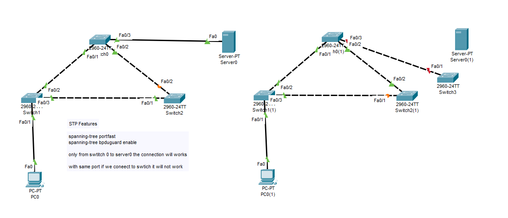

# 🌐 Lab 10: STP Security Features (PortFast & BPDU Guard) Lab

Welcome to **Lab 10: STP Security Features (PortFast & BPDU Guard) Lab** configured in **Cisco Packet Tracer**! This lab demonstrates how to harden Layer 2 campus networks using **Spanning Tree PortFast** and **BPDU Guard**, preventing unauthorized switch insertion, rogue Root Bridge hijacking, and Layer 2 broadcast loops.

---

## 📸 Topology Diagram



---

## 🎯 Lab Objectives

1. **Optimize Edge Port Convergence (PortFast)**: Configure `spanning-tree portfast` on access interfaces connected to end-hosts (`Server0`, `PC0`) to bypass 30-second STP Listening and Learning delay states.
2. **Harden Edge Security (BPDU Guard)**: Configure `spanning-tree bpduguard enable` to protect access ports against unauthorized switch attachments.
3. **Demonstrate Valid Host Connectivity (Left Topology)**: Verify that legitimate end devices (`Server0`, `PC0`) establish immediate connectivity without triggering security violations.
4. **Simulate Rogue Switch Attack & BPDU Guard Violation (Right Topology)**: Attach an unauthorized switch (`Switch3`) to a PortFast-enabled port (`Switch0(1) Fa0/3`) and observe BPDU Guard placing the port into the **`err-disabled` state (Link Down / Red LED 🔴)**.
5. **Configure Err-Disabled Recovery**: Implement manual (`shutdown` / `no shutdown`) and automatic (`errdisable recovery cause bpduguard`) port recovery mechanisms.
6. **Evaluate Advantages & Disadvantages**: Provide a comprehensive analysis of PortFast and BPDU Guard for enterprise network security.

---

## 🛠️ Network Addressing & Topology Architecture

### 1️⃣ Valid Host Connection Topology (Left Side - Normal Operation)

| Device | Model | Interface | Connected Device / Port | PortFast Status | BPDU Guard Status | Operational State |
| :--- | :--- | :--- | :--- | :---: | :---: | :--- |
| **Switch0** | Catalyst 2960-24TT | `Fa0/1` | `Switch1` (`Fa0/2`) | Disabled | Disabled | Forwarding (Root Port) |
| | | `Fa0/2` | `Switch2` (`Fa0/2`) | Disabled | Disabled | Forwarding (Designated Port) |
| | | `Fa0/3` | `Server0` (`Fa0`) | **Enabled** | **Enabled** | **Forwarding (Instant FWD 🟢)** |
| **Switch1** | Catalyst 2960-24TT | `Fa0/1` | `PC0` (`Fa0`) | **Enabled** | **Enabled** | **Forwarding (Instant FWD 🟢)** |
| | | `Fa0/2` | `Switch0` (`Fa0/1`) | Disabled | Disabled | Forwarding (Designated Port) |
| | | `Fa0/3` | `Switch2` (`Fa0/1`) | Disabled | Disabled | Forwarding (Designated Port) |
| **Switch2** | Catalyst 2960-24TT | `Fa0/1` | `Switch1` (`Fa0/3`) | Disabled | Disabled | Forwarding (Root Port) |
| | | `Fa0/2` | `Switch0` (`Fa0/2`) | Disabled | Disabled | Blocking (Alternate Port 🟠) |
| **Server0** | Server Host | `Fa0` | `Switch0` (`Fa0/3`) | N/A | N/A | Connected (Valid Host) |
| **PC0** | VPCS Host | `Fa0` | `Switch1` (`Fa0/1`) | N/A | N/A | Connected (Valid Host) |

---

### 2️⃣ Rogue Switch Attack Topology (Right Side - Security Violation)

| Device | Model | Interface | Connected Device / Port | Security Feature | Violation Event | Resulting Port State |
| :--- | :--- | :--- | :--- | :--- | :--- | :--- |
| **Switch0(1)** | Catalyst 2960-24TT | `Fa0/3` | `Switch3` (`Fa0/1`) | PortFast + BPDU Guard | **Rogue Switch Sent BPDU** | **`err-disabled` (Down/Down 🔴)** |
| **Switch3** | Rogue Switch | `Fa0/1` | `Switch0(1)` (`Fa0/3`) | Default STP | Sent BPDU into Access Port | **Link Down (Red 🔴)** |
| **Switch1(1)** | Catalyst 2960-24TT | `Fa0/1` | `PC0(1)` (`Fa0`) | PortFast + BPDU Guard | Valid Host Traffic | Forwarding (Connected 🟢) |
| **Switch2(1)** | Catalyst 2960-24TT | `Fa0/1` | `Switch1(1)` (`Fa0/3`) | Standard STP | Normal STP Interconnect | Blocking (Alternate Port 🟠) |

---

## 🧠 Technical Deep-Dive: PortFast & BPDU Guard

### 1. Spanning Tree PortFast
Under default IEEE 802.1D Spanning Tree, when an access port connects to a device, it traverses **Blocking (20s) ➔ Listening (15s) ➔ Learning (15s) ➔ Forwarding** — taking **30 to 50 seconds** before data traffic flows.

- **Problem solved by PortFast**: PCs, printers, and servers powering ON often time out while waiting for DHCP IP allocation because the port is stuck in Listening/Learning states.
- **PortFast Behavior**:
  - Immediately transitions an access port to the **Forwarding** state upon link insertion.
  - Suppresses **Topology Change Notifications (TCNs)** when an end-host turns ON or OFF, preventing unnecessary MAC address table flushes across the switch network.

---

### 2. Spanning Tree BPDU Guard
While PortFast solves the bootup delay problem, it introduces a severe security risk: if a user plugs an unauthorized switch or hub into a PortFast-enabled wall jack, a physical loop is created instantly before STP can detect it.

- **BPDU Guard Behavior**:
  - Monitors PortFast-enabled access interfaces for incoming Bridge Protocol Data Units (BPDUs).
  - End hosts (`PC`, `Server`, `Printer`) **never** generate BPDUs. Only switches originate BPDUs.
  - If a BPDU is received on a BPDU Guard-protected port (indicating a switch or rogue device is attached), BPDU Guard **immediately shuts down the interface** and places it into the **`err-disabled`** state.
  - The port LED turns **solid RED**, preventing rogue switches from hijacking the Root Bridge role or injecting loops into the enterprise network.

---

## ⚖️ Advantages and Disadvantages

### 🔹 Spanning Tree PortFast

#### ✅ Advantages of PortFast
1. **Instant Forwarding (0-Second Delay)**: Eliminates the 30-second STP Listening and Learning delays, enabling workstations to obtain DHCP IP parameters immediately upon bootup.
2. **Eliminates Campus MAC Table Instability**: Suppresses Topology Change Notification (TCN) generation when end devices connect or disconnect, preventing unnecessary campus-wide MAC address table flushes.
3. **Optimized Application Performance**: Prevents network application bootup failures and PXE network boot timeouts caused by delayed port initialization.

#### ❌ Disadvantages of PortFast
1. **Catastrophic Loop Hazard if Unprotected**: Pluggings a switch, hub, or bridged network adapter into an unprotected PortFast port causes an instantaneous Layer 2 broadcast storm before STP can react.
2. **Incompatible with Switch-to-Switch Links**: Enabling PortFast on inter-switch trunk links risks creating immediate physical loops and packet duplication.

---

### 🔹 Spanning Tree BPDU Guard

#### ✅ Advantages of BPDU Guard
1. **Proactive Layer 2 Access Security**: Prevents unauthorized personnel from connecting rogue switches, home routers, or wireless access points to wall jacks.
2. **Prevents Root Bridge Hijacking**: Blocks unauthorized switches from attempting to claim the STP Root Bridge role via superior BPDUs.
3. **Instant Automated Violation Containment**: Immediately disables violating ports (`err-disabled`) without requiring manual administrative monitoring.
4. **Simple Campus-Wide Policy Enforcement**: Can be applied globally across all PortFast interfaces with a single command (`spanning-tree portfast bpduguard default`).

#### ❌ Disadvantages of BPDU Guard
1. **Service Interruption on False Positives**: Virtualized hosts (e.g., VMware ESXi, Hyper-V running virtual switches) or IP phones that send BPDUs can inadvertently trigger port shutdown.
2. **Requires Manual or Scheduled Port Recovery**: Once in the `err-disabled` state, ports remain shutdown permanently until an administrator resets them (`shutdown` / `no shutdown`) or configures automatic timer-based recovery.
3. **Increased Operational Overhead**: Network engineers must inspect and clear `err-disabled` ports caused by user errors.

---

## ⚙️ Cisco IOS Configuration Commands

### 🔹 1. Interface-Level Configuration (PortFast & BPDU Guard)
```cisco
Switch# configure terminal
Switch(config)# interface FastEthernet 0/3
Switch(config-if)# description Connected to Edge Host (Server0)
Switch(config-if)# switchport mode access
Switch(config-if)# switchport access vlan 1

! Enable PortFast on Access Port
Switch(config-if)# spanning-tree portfast

! Enable BPDU Guard on Access Port
Switch(config-if)# spanning-tree bpduguard enable
Switch(config-if)# exit
```

### 🔹 2. Global-Level Configuration (Recommended for Enterprise Access Layers)
```cisco
! Enable PortFast globally on all non-trunking access ports
Switch(config)# spanning-tree portfast default

! Enable BPDU Guard globally on all PortFast-enabled ports
Switch(config)# spanning-tree portfast bpduguard default
```

---

## 🛠️ Err-Disabled Port Recovery Procedures

When BPDU Guard detects a rogue switch, the port console displays:
```text
%SPANTREE-2-BLOCK_BPDUGUARD: Received BPDU on port FastEthernet0/3 with BPDU Guard enabled. Disabling port.
%PM-4-ERR_DISABLE: bpduguard error detected on Fa0/3, putting Fa0/3 in err-disable state
```

### Method 1: Manual Administrative Reset
```cisco
Switch# configure terminal
Switch(config)# interface FastEthernet 0/3
Switch(config-if)# shutdown
Switch(config-if)# no shutdown
```

### Method 2: Automatic Err-Disabled Recovery (Timer-Based)
```cisco
Switch# configure terminal
! Enable automatic recovery for BPDU Guard violations
Switch(config)# errdisable recovery cause bpduguard

! Set recovery timer interval to 300 seconds (5 minutes)
Switch(config)# errdisable recovery interval 300
```

---

## 🔍 Verification & Inspection Commands

Use these Cisco IOS commands to monitor PortFast, BPDU Guard, and `err-disabled` states:

```cisco
# 1. View all interfaces currently in err-disabled state
Switch# show interfaces status err-disabled

# 2. Check Spanning Tree PortFast and BPDU Guard global settings
Switch# show spanning-tree summary

# 3. View detailed interface STP status and PortFast enablement
Switch# show spanning-tree interface FastEthernet 0/3 detail

# 4. View active err-disabled recovery timer status
Switch# show errdisable recovery
```

---

## 👤 Author & Repository

- **Repository**: [Networking Labs](https://github.com/chakreshram11/Networking-Labs)
- **Author**: Kudupudi Chakresh Ram (`chakreshram11`)
