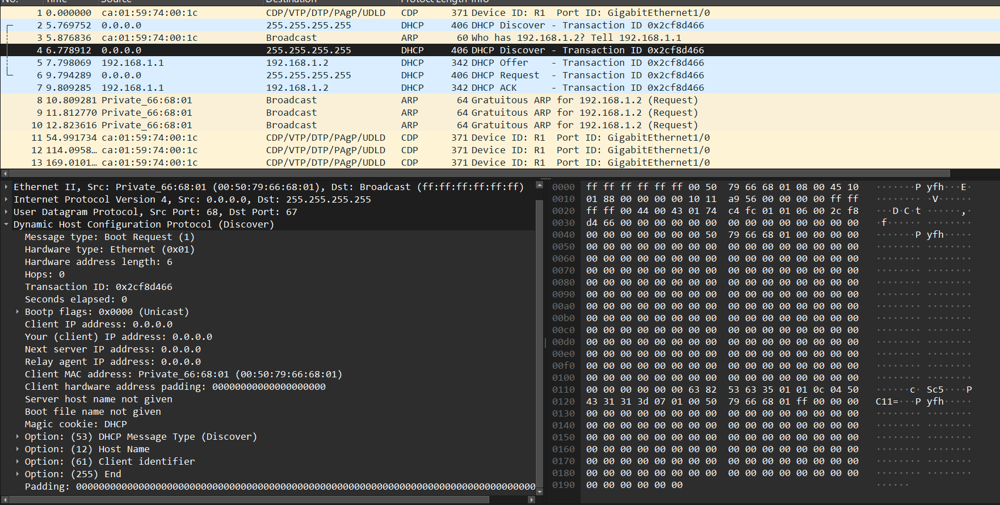
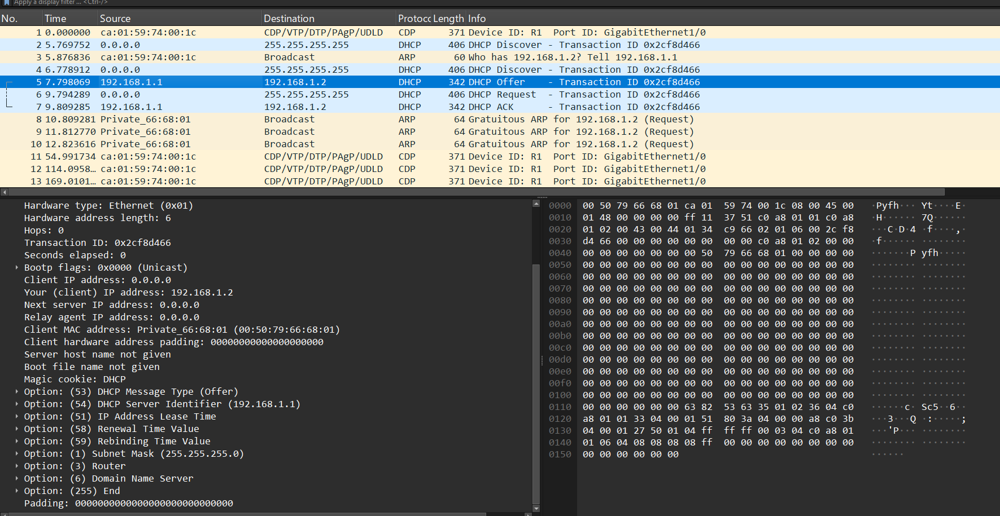
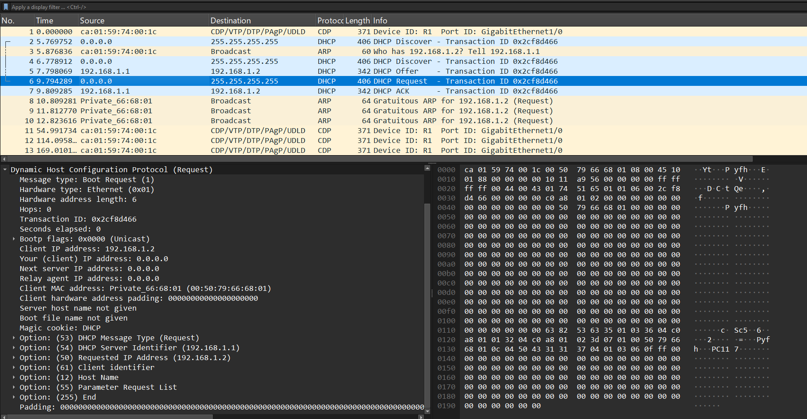
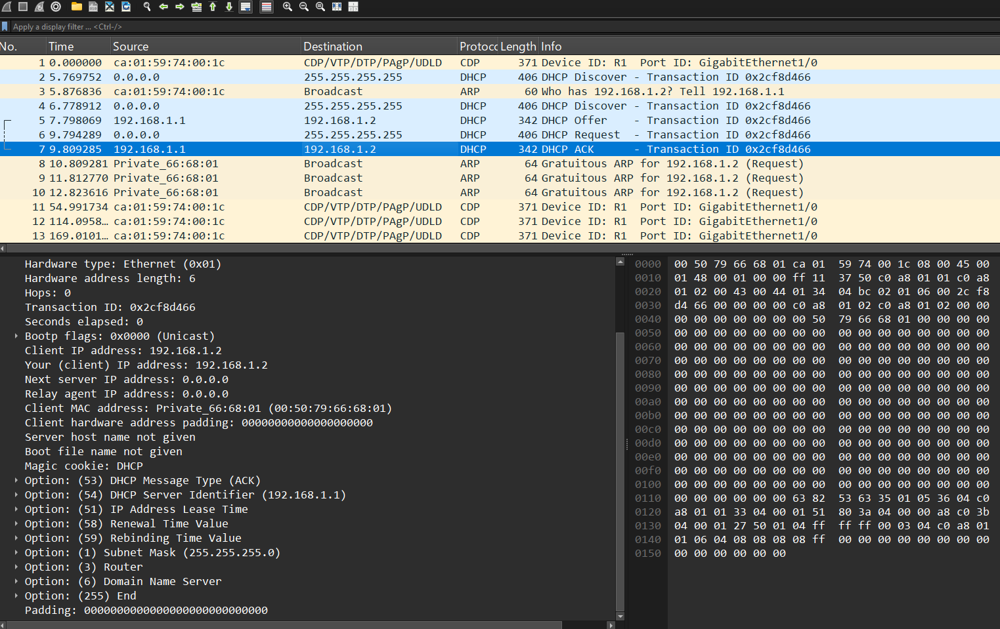
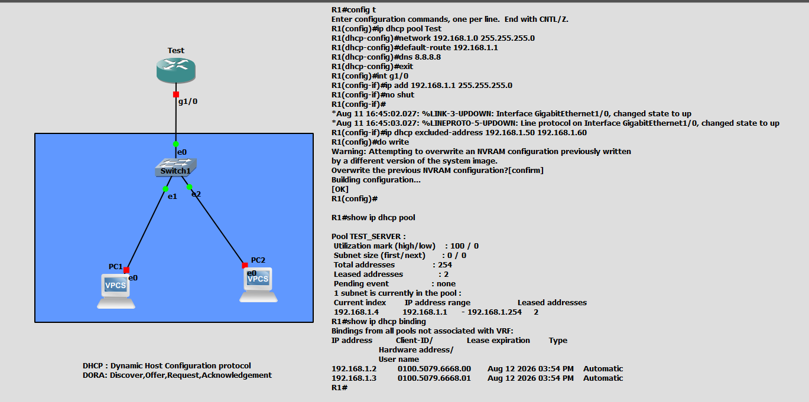

# DHCP Configuration & DORA Packet Analysis

A practical GNS3 / Wireshark lab demonstrating **DHCP server configuration**, the **DORA process**, DHCP packet flow, and important DHCP options.

---

## 📌 Overview

**DHCP (Dynamic Host Configuration Protocol)** automatically provides network configuration information to clients, including:

- IP address
- Subnet mask
- Default gateway
- DNS server
- Lease information

This lab uses a Cisco router as the DHCP server and two VPCS clients connected through a switch.

---

## 🖥️ Network Topology

```text
                 ┌──────────────┐
                 │      R1      │
                 │ DHCP Server  │
                 │ 192.168.1.1  │
                 │   Gi1/0      │
                 └──────┬───────┘
                        │
                        │
                 ┌──────┴───────┐
                 │    Switch1   │
                 └──────┬───────┘
                    ┌───┴───┐
                    │       │
                  PC1      PC2
                 VPCS     VPCS
```

### Addressing

| Device | Interface | IP Address | Role |
|---|---|---|---|
| R1 | GigabitEthernet1/0 | `192.168.1.1/24` | DHCP Server / Gateway |
| PC1 | e0 | `192.168.1.2` | DHCP Client |
| PC2 | e0 | `192.168.1.3` | DHCP Client |
| Network | — | `192.168.1.0/24` | DHCP Network |

---

# ⚙️ Cisco DHCP Server Configuration

The router was configured with the following commands:

```cisco
R1# configure terminal

R1(config)# ip dhcp pool TEST_SERVER

R1(dhcp-config)# network 192.168.1.0 255.255.255.0
R1(dhcp-config)# default-router 192.168.1.1
R1(dhcp-config)# dns 8.8.8.8
R1(dhcp-config)# exit

R1(config)# interface gigabitEthernet 1/0
R1(config-if)# ip address 192.168.1.1 255.255.255.0
R1(config-if)# no shutdown
R1(config-if)# exit

R1(config)# ip dhcp excluded-address 192.168.1.50 192.168.1.60

R1(config)# do write
```

### Configuration Explanation

| Command | Purpose |
|---|---|
| `ip dhcp pool TEST_SERVER` | Creates a DHCP pool named `TEST_SERVER` |
| `network 192.168.1.0 255.255.255.0` | Defines the network from which addresses are allocated |
| `default-router 192.168.1.1` | Provides the default gateway to clients |
| `dns 8.8.8.8` | Provides Google's public DNS server |
| `ip address 192.168.1.1 255.255.255.0` | Assigns the router's LAN IP |
| `no shutdown` | Enables the router interface |
| `ip dhcp excluded-address 192.168.1.50 192.168.1.60` | Prevents those addresses from being assigned dynamically |
| `do write` | Saves the configuration to NVRAM |

---

# 📊 DHCP Pool Verification

The following command was used to verify the DHCP pool:

```cisco
R1# show ip dhcp pool
```

Observed output:

```text
Pool TEST_SERVER :
 Utilization mark (high/low) : 100 / 0
 Subnet size (first/next)    : 0 / 0
 Total addresses             : 254
 Leased addresses            : 2

Current index        IP address range
192.168.1.4          192.168.1.1 - 192.168.1.254
```

The router shows **2 leased addresses**, corresponding to the DHCP clients.

---

# 🔎 DHCP Binding Verification

The DHCP bindings were checked using:

```cisco
R1# show ip dhcp binding
```

Observed clients:

```text
IP address      Client-ID/              Lease expiration        Type
                Hardware address/

192.168.1.2     0100.5079.6668.00       Aug 12 2026 03:54 PM    Automatic
192.168.1.3     0100.5079.6668.01       Aug 12 2026 03:54 PM    Automatic
```

This confirms that the router dynamically assigned:

- `192.168.1.2` to PC1
- `192.168.1.3` to PC2

---

# 🔄 DHCP DORA Process

DHCP uses the **DORA** process to dynamically assign an IP address.

```text
Client                         DHCP Server
  │                                 │
  │──── DHCP DISCOVER ─────────────>│
  │                                 │
  │<──── DHCP OFFER ────────────────│
  │                                 │
  │──── DHCP REQUEST ──────────────>│
  │                                 │
  │<──── DHCP ACK ──────────────────│
  │                                 │
  ▼                                 ▼
IP configuration complete
```

### DORA Meaning

| Letter | Message | Direction | Purpose |
|---|---|---|---|
| **D** | Discover | Client → Server | Client searches for DHCP servers |
| **O** | Offer | Server → Client | Server offers an IP address |
| **R** | Request | Client → Server | Client requests the offered address |
| **A** | Acknowledgment | Server → Client | Server confirms the lease |

---

# 📡 Packet Capture Analysis

The DHCP exchange was captured and analyzed in Wireshark.

The captured sequence contains:

```text
1. DHCP Discover
2. ARP
3. DHCP Offer
4. DHCP Request
5. DHCP ACK
6. Gratuitous ARP
```

---

## 1️⃣ DHCP Discover

The client initially has no IP address:

```text
Source:      0.0.0.0
Destination: 255.255.255.255
Protocol:    DHCP
Info:        DHCP Discover
```

Important packet fields:

```text
Message type: Boot Request (1)
Hardware type: Ethernet (0x01)
Hardware address length: 6
Transaction ID: 0x2cf8d466
Client IP address: 0.0.0.0
Your (client) IP address: 0.0.0.0
Client MAC address: 00:50:79:66:68:01
Magic cookie: DHCP
```

The client uses the broadcast address because it does not yet know the DHCP server's IP address.



---

## 2️⃣ DHCP Offer

The DHCP server responds with an available IP address.

Observed:

```text
Source:      192.168.1.1
Destination: 192.168.1.2
Protocol:    DHCP
Info:        DHCP Offer
```

Important DHCP options:

```text
Option (53): DHCP Message Type (Offer)
Option (54): DHCP Server Identifier (192.168.1.1)
Option (51): IP Address Lease Time
Option (58): Renewal Time Value
Option (59): Rebinding Time Value
Option (1):  Subnet Mask (255.255.255.0)
Option (3):  Router
Option (6):  Domain Name Server
Option (255): End
```

The server is offering `192.168.1.2` to the client.



---

## 3️⃣ DHCP Request

The client accepts the offered configuration by sending a DHCP Request.

Observed:

```text
Source:      0.0.0.0
Destination: 255.255.255.255
Protocol:    DHCP
Info:        DHCP Request
```

Important fields:

```text
Client IP address: 192.168.1.2
Your (client) IP address: 0.0.0.0
Client MAC address: 00:50:79:66:68:01
```

Important DHCP options:

```text
Option (53): DHCP Message Type (Request)
Option (54): DHCP Server Identifier (192.168.1.1)
Option (50): Requested IP Address (192.168.1.2)
Option (61): Client Identifier
Option (12): Host Name
Option (55): Parameter Request List
Option (255): End
```

The `Requested IP Address` option tells the DHCP server which address the client wants to use.



---

## 4️⃣ DHCP ACK

The DHCP server confirms the allocation using DHCP ACK.

Observed:

```text
Source:      192.168.1.1
Destination: 192.168.1.2
Protocol:    DHCP
Info:        DHCP ACK
```

The packet confirms:

```text
Your (client) IP address: 192.168.1.2
DHCP Server Identifier: 192.168.1.1
Subnet Mask: 255.255.255.0
Router: 192.168.1.1
Domain Name Server: 8.8.8.8
```

Important options:

```text
Option (53): DHCP Message Type (ACK)
Option (54): DHCP Server Identifier (192.168.1.1)
Option (51): IP Address Lease Time
Option (58): Renewal Time Value
Option (59): Rebinding Time Value
Option (1):  Subnet Mask (255.255.255.0)
Option (3):  Router
Option (6):  Domain Name Server
Option (255): End
```

After receiving the ACK, the client can use the assigned IP configuration.



---

# 🧩 DHCP Packet Options

DHCP options carry additional configuration information between the DHCP client and server.

| Option | Name | Function |
|---:|---|---|
| `1` | Subnet Mask | Specifies the client's subnet mask |
| `3` | Router | Specifies the default gateway |
| `6` | Domain Name Server | Specifies DNS servers |
| `12` | Host Name | Identifies the client's hostname |
| `50` | Requested IP Address | IP address requested by the client |
| `51` | IP Address Lease Time | Duration of the IP lease |
| `53` | DHCP Message Type | Identifies Discover, Offer, Request, ACK, etc. |
| `54` | DHCP Server Identifier | Identifies the DHCP server |
| `55` | Parameter Request List | Parameters requested by the client |
| `58` | Renewal Time Value | Time when the client should attempt renewal |
| `59` | Rebinding Time Value | Time when the client enters rebinding |
| `61` | Client Identifier | Identifies the DHCP client |
| `255` | End | Marks the end of DHCP options |

---

# 🌐 DHCP Ports

DHCP uses UDP.

```text
DHCP Server: UDP 67
DHCP Client: UDP 68
```

Communication:

```text
Client                         Server
UDP 68  ─────────────────────> UDP 67
UDP 68  <───────────────────── UDP 67
```

Because the client initially does not have an IP address, DHCP Discover is commonly sent as a broadcast:

```text
0.0.0.0 → 255.255.255.255
```

---

# 🔍 Wireshark Filters

Useful Wireshark display filters for this lab:

### Display all DHCP traffic

```text
dhcp
```

### Display DHCP Discover

```text
dhcp.option.dhcp == 1
```

### Display DHCP Offer

```text
dhcp.option.dhcp == 2
```

### Display DHCP Request

```text
dhcp.option.dhcp == 3
```

### Display DHCP ACK

```text
dhcp.option.dhcp == 5
```

### Display DHCP and ARP traffic

```text
dhcp || arp
```

---

# 🧪 Lab Verification

### Check router interface

```cisco
R1# show ip interface brief
```

Expected:

```text
GigabitEthernet1/0    192.168.1.1    up    up
```

### Check DHCP pool

```cisco
R1# show ip dhcp pool
```

### Check assigned leases

```cisco
R1# show ip dhcp binding
```

### Check configuration

```cisco
R1# show running-config
```

---

# 📸 Screenshots

### Cisco Router DHCP Configuration



### DHCP Discover


### DHCP Offer


### DHCP Request


### DHCP ACK


---

# 📚 Key Concepts Learned

- DHCP server configuration on Cisco IOS
- DHCP address pools
- DHCP excluded addresses
- DHCP leases and bindings
- DHCP DORA process
- DHCP Discover, Offer, Request, and ACK packets
- DHCP message types
- DHCP options
- UDP ports 67 and 68
- Broadcast communication during DHCP initialization
- Packet analysis using Wireshark
- ARP activity associated with DHCP address assignment

---

# 📝 Conclusion

This lab demonstrates the complete DHCP address-assignment process from the client's initial **DHCP Discover** to the server's **DHCP ACK**.

The Cisco router acts as the DHCP server and provides clients with IP addresses, subnet masks, default gateway information, and DNS configuration. Wireshark was used to inspect the packets and verify the DORA process at the protocol level.

> **DHCP = Dynamic Host Configuration Protocol**  
> **DORA = Discover → Offer → Request → Acknowledgment**

---

## 🛠️ Technologies & Tools

- Cisco IOS
- GNS3 / VPCS
- Wireshark
- DHCP
- UDP
- ARP
- IPv4
