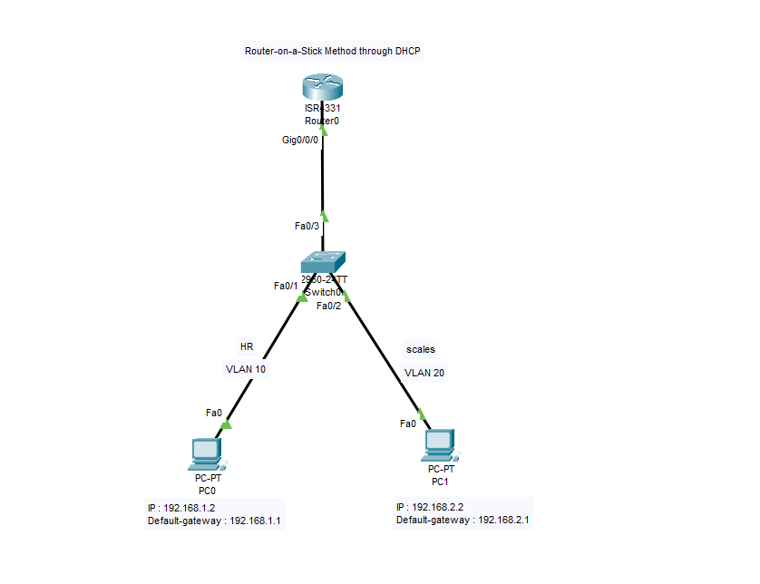
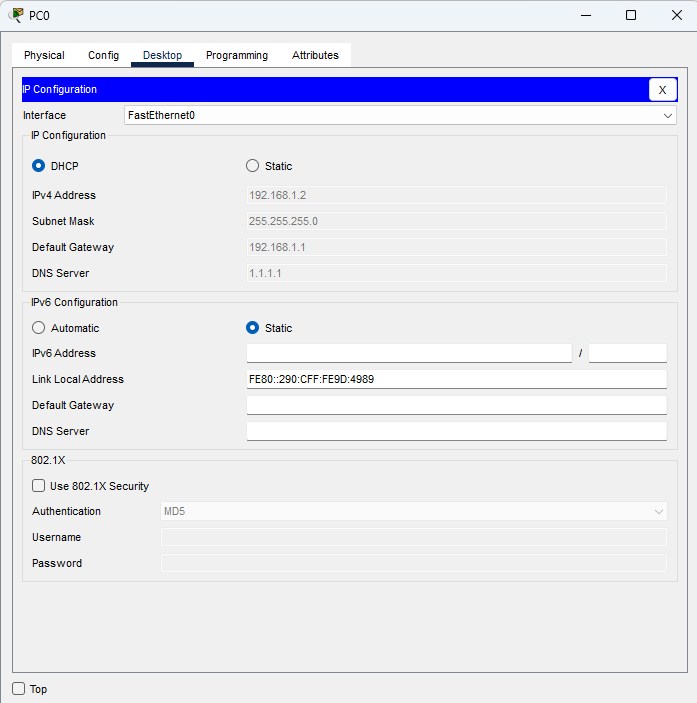
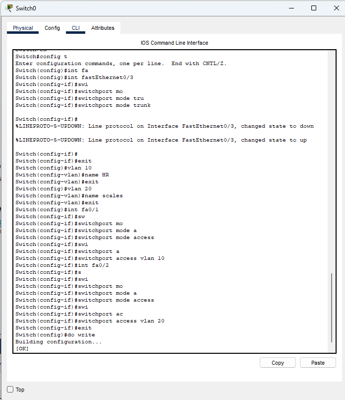
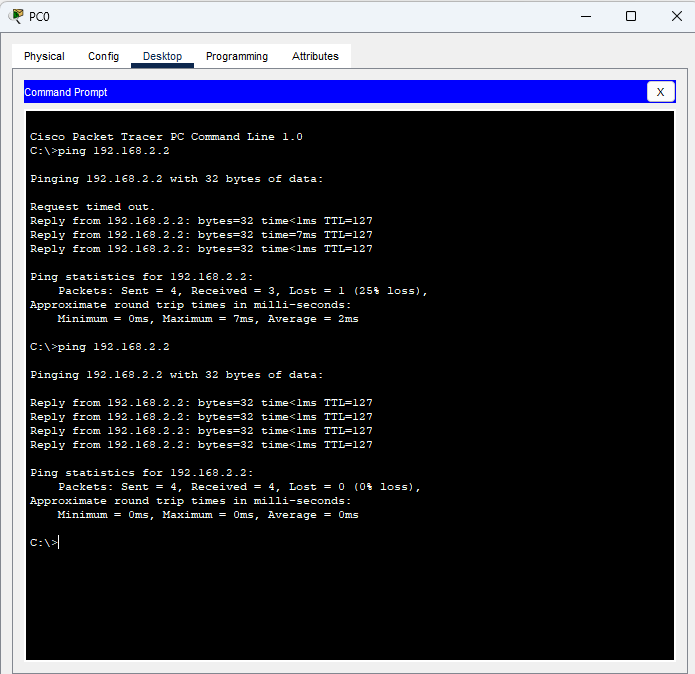

# 🌐 Cisco Router-on-a-Stick Inter-VLAN Routing with DHCP

A Cisco Packet Tracer lab demonstrating **Inter-VLAN Routing using the Router-on-a-Stick method combined with an integrated Router DHCP Server**.

In this lab, a Cisco ISR 4331 router provides:

- Inter-VLAN routing across distinct subnets
- Dynamic Host Configuration Protocol (DHCP) services for multiple VLANs
- Default gateway allocation for each VLAN
- Custom DNS server information assignment (`1.1.1.1` and `2.2.2.2`)

A Cisco 2960 switch is configured with VLAN 10 (`HR`) and VLAN 20 (`SCALES`), with the router connected through an **802.1Q trunk link**.

The end devices obtain their IPv4 configuration automatically through DHCP and communicate across different VLANs through the router.

---

## 📸 Topology Diagram



---

## 📌 Lab Objectives

The main objectives of this lab are:

- Create multiple VLANs on a Cisco switch
- Assign access ports to specific VLANs
- Configure an 802.1Q trunk between the switch and router
- Configure Router-on-a-Stick
- Create router subinterfaces for different VLANs
- Configure DHCP pools on the router for automated IP allocation
- Automatically assign IP addresses to PCs via DHCP
- Configure default gateways through DHCP
- Configure DNS server information through DHCP
- Enable communication between different VLANs
- Verify DHCP and Inter-VLAN connectivity
- Evaluate the advantages and disadvantages of ROAS with integrated DHCP
- Troubleshoot VLAN, trunk, DHCP, and routing issues

---

# 🗺️ Network Topology

```text
                         Cisco ISR 4331
                            Router0
                              |
                           Gi0/0/0
                              |
                              | 802.1Q TRUNK
                              |
                            Fa0/3
                        +-------------+
                        |   Switch0   |
                        | Cisco 2960  |
                        +------+------+
                               |
                    +----------+----------+
                    |                     |
                  Fa0/1                 Fa0/2
                    |                     |
                 VLAN 10               VLAN 20
                    |                     |
                   PC0                   PC1
                    |                     |
             DHCP Client             DHCP Client
```

---

# 🌐 Network Design

The lab uses two VLANs:

| VLAN ID | Name | Network Subnet | Default Gateway | DNS Server |
| ---: | :--- | :--- | :--- | :--- |
| **10** | `HR` | `192.168.1.0/24` | `192.168.1.1` | `1.1.1.1` |
| **20** | `SCALES` | `192.168.2.0/24` | `192.168.2.1` | `2.2.2.2` |

### Device Connections

| Device | Interface | Connected To | Mode / Type |
| :--- | :--- | :--- | :--- |
| **Router0** | `Gi0/0/0` | Switch0 `Fa0/3` | 802.1Q Trunk |
| **Switch0** | `Fa0/1` | PC0 `Fa0` | Access VLAN 10 (`HR`) |
| **Switch0** | `Fa0/2` | PC1 `Fa0` | Access VLAN 20 (`SCALES`) |

---

# 🖥️ IP Addressing & DHCP Allocation

The PCs are configured as **DHCP clients**, so their IPv4 parameters are assigned dynamically upon bootup.

### 🔹 PC0 (VLAN 10 - HR)

Expected DHCP configuration allocated by Router0:

```text
IP Address:      192.168.1.2
Subnet Mask:     255.255.255.0
Default Gateway: 192.168.1.1
DNS Server:      1.1.1.1
VLAN:            10
```



---

### 🔹 PC1 (VLAN 20 - SCALES)

Expected DHCP configuration allocated by Router0:

```text
IP Address:      192.168.2.2
Subnet Mask:     255.255.255.0
Default Gateway: 192.168.2.1
DNS Server:      2.2.2.2
VLAN:            20
```

> **Note:** DHCP may assign different host addresses if leases change. The addresses above represent the successful DHCP allocation demonstrated in this lab.

---

# 🔹 VLAN Configuration

Two VLANs are created on the Cisco Catalyst 2960 switch:

| VLAN ID | Name | Purpose | Assigned Interface |
| ---: | :--- | :--- | :--- |
| **10** | `HR` | PC0 Network | `FastEthernet0/1` |
| **20** | `SCALES` | PC1 Network | `FastEthernet0/2` |

---

# ⚙️ Switch Configuration

Enter configuration mode:
```cisco
enable
configure terminal
hostname Switch0
```

### Create VLAN 10
```cisco
vlan 10
 name HR
 exit
```

### Create VLAN 20
```cisco
vlan 20
 name SCALES
 exit
```

### Configure PC0 Access Port (VLAN 10)
PC0 is connected to `FastEthernet0/1`:
```cisco
interface FastEthernet0/1
 switchport mode access
 switchport access vlan 10
 no shutdown
 exit
```

### Configure PC1 Access Port (VLAN 20)
PC1 is connected to `FastEthernet0/2`:
```cisco
interface FastEthernet0/2
 switchport mode access
 switchport access vlan 20
 no shutdown
 exit
```

### Configure Trunk Port
The router is connected to Switch0 through `FastEthernet0/3`:
```cisco
interface FastEthernet0/3
 switchport mode trunk
 switchport trunk allowed vlan 10,20
 no shutdown
 exit
```

Save configuration:
```cisco
end
write memory
```



---

# 🚦 Router-on-a-Stick Configuration

Router-on-a-Stick allows a single physical router interface to handle traffic from multiple VLANs using separate logical subinterfaces.

```text
                         Router0
                       Gi0/0/0
                          |
                    802.1Q Trunk
                          |
                       Switch0
                     /         \
                VLAN 10       VLAN 20
                   |             |
                  PC0           PC1
```

The router uses:
- `Gi0/0/0.10` ➔ Default Gateway for VLAN 10 (`192.168.1.1`)
- `Gi0/0/0.20` ➔ Default Gateway for VLAN 20 (`192.168.2.1`)

---

# ⚙️ Router Configuration

## Enable the Physical Interface
```cisco
enable
configure terminal
hostname Router0

interface GigabitEthernet0/0/0
 no shutdown
 exit
```

## VLAN 10 Router Subinterface
Configure the VLAN 10 subinterface:
```cisco
interface GigabitEthernet0/0/0.10
 encapsulation dot1Q 10
 ip address 192.168.1.1 255.255.255.0
 exit
```

## VLAN 20 Router Subinterface
Configure the VLAN 20 subinterface:
```cisco
interface GigabitEthernet0/0/0.20
 encapsulation dot1Q 20
 ip address 192.168.2.1 255.255.255.0
 exit
```

---

# 📡 DHCP Configuration

The router also operates as the DHCP server for both VLANs, enabling PCs to automatically receive IP parameters.

### Exclude Gateway Addresses
Prevent default gateway IPs from being dynamically assigned to hosts:
```cisco
ip dhcp excluded-address 192.168.1.1
ip dhcp excluded-address 192.168.2.1
```

### DHCP Pool — VLAN 10
```cisco
ip dhcp pool VLAN-10
 network 192.168.1.0 255.255.255.0
 default-router 192.168.1.1
 dns-server 1.1.1.1
 exit
```

### DHCP Pool — VLAN 20
```cisco
ip dhcp pool VLAN-20
 network 192.168.2.0 255.255.255.0
 default-router 192.168.2.1
 dns-server 2.2.2.2
 exit
```

Save router configuration:
```cisco
end
write memory
```

---

# ⚖️ Advantages and Disadvantages

### 🔹 Router-on-a-Stick (ROAS) with Integrated Router DHCP Server

#### ✅ Advantages
1. **Unified Network Management**: Consolidates Inter-VLAN routing and dynamic IP address allocation (DHCP) into a single router, avoiding the need for dedicated external Windows/Linux DHCP servers.
2. **Zero-Touch Host Onboarding**: Eliminates manual IP static assignment errors; client PCs automatically receive valid IP addresses, subnet masks, default gateways, and DNS servers upon bootup.
3. **VLAN-Aware Subnet Segregation**: Directly binds DHCP pools to corresponding router subinterfaces (`Gi0/0/0.10` ➔ `192.168.1.0/24`, `Gi0/0/0.20` ➔ `192.168.2.0/24`), ensuring hosts receive the exact default gateway corresponding to their assigned VLAN.
4. **Capital Expenditure (CapEx) Savings**: Reuses existing physical router hardware for multi-VLAN routing and IP management in cost-sensitive branch networks.

#### ❌ Disadvantages
1. **Router CPU & RAM Load**: Handling DHCP lease generation, renewal timers, and binding databases alongside packet routing increases router control plane overhead.
2. **Single Point of Failure (SPOF)**: If the router interface (`Gi0/0/0`) or trunk link fails, both Inter-VLAN routing and dynamic IP address assignment fail simultaneously across all VLANs.
3. **Trunk Bandwidth Bottleneck ("Hairpinning")**: All inter-VLAN traffic must travel up and down the single physical trunk link, limiting throughput to the physical interface capacity.
4. **Limited Advanced Enterprise DHCP Features**: Cisco IOS DHCP lacks advanced features found in dedicated IPAM systems (such as Infoblox or Microsoft DHCP), including complex lease options, clustering, and dynamic DNS integration.

---

# 🔄 How Inter-VLAN Routing Works

PC0 and PC1 belong to different VLANs and different IP subnets:

```text
PC0 (192.168.1.2 / VLAN 10)
     │
     │ 802.1Q Tag 10
     ▼
Switch0 (Fa0/3 Trunk) ──> Router0 (Gi0/0/0.10: 192.168.1.1)
                                   │
                                   │ Layer 3 Routing Engine
                                   ▼
PC1 (192.168.2.2 / VLAN 20) <── Switch0 <── Router0 (Gi0/0/0.20: 192.168.2.1)
```

When PC0 communicates with PC1:
1. PC0 determines `192.168.2.2` is outside its local subnet (`192.168.1.0/24`) and forwards traffic to its default gateway (`192.168.1.1`).
2. Router0 receives the frame on subinterface `Gi0/0/0.10`.
3. Router0 inspects its routing table, determines `192.168.2.0/24` is directly connected on `Gi0/0/0.20`, and routes the packet.
4. Router0 encapsulates the frame with 802.1Q Tag 20 and sends it back out `Gi0/0/0` to Switch0, which delivers it to PC1.

---

# 🧪 Connectivity Testing

### Test 1 — PC0 to Default Gateway
From PC0 Command Prompt:
```cmd
ping 192.168.1.1
```
**Expected Output**: `Reply from 192.168.1.1: bytes=32 time<1ms TTL=255`

### Test 2 — PC1 to Default Gateway
From PC1 Command Prompt:
```cmd
ping 192.168.2.1
```
**Expected Output**: `Reply from 192.168.2.1: bytes=32 time<1ms TTL=255`

### Test 3 — Inter-VLAN Ping (PC0 to PC1)
From PC0 Command Prompt:
```cmd
ping 192.168.2.2
```
**Expected Output**:
```text
Pinging 192.168.2.2 with 32 bytes of data:
Reply from 192.168.2.2: bytes=32 time<1ms TTL=127
Reply from 192.168.2.2: bytes=32 time<1ms TTL=127
Reply from 192.168.2.2: bytes=32 time<1ms TTL=127
Reply from 192.168.2.2: bytes=32 time<1ms TTL=127
```



---

# 🔍 Verification Commands

### 1. Verify Switch VLANs
```cisco
show vlan brief
```

### 2. Verify Switch Trunk Link
```cisco
show interfaces trunk
```

### 3. Verify Router Subinterfaces
```cisco
show ip interface brief
```
*Expected: `Gi0/0/0.10` (`192.168.1.1`) and `Gi0/0/0.20` (`192.168.2.1`) operating `up/up`.*

### 4. Verify Router Routing Table
```cisco
show ip route
```

### 5. Verify DHCP Pools & Bindings
```cisco
show ip dhcp pool
show ip dhcp binding
show ip dhcp server statistics
```

---

# 📊 Verification Summary Matrix

| Test Case | Verification Target | Status |
| :--- | :--- | :---: |
| **PC0 DHCP Lease** | Received `192.168.1.2`, GW `192.168.1.1`, DNS `1.1.1.1` | ✅ Pass |
| **PC1 DHCP Lease** | Received `192.168.2.2`, GW `192.168.2.1`, DNS `2.2.2.2` | ✅ Pass |
| **PC0 Gateway Ping** | `ping 192.168.1.1` successful | ✅ Pass |
| **PC1 Gateway Ping** | `ping 192.168.2.1` successful | ✅ Pass |
| **VLAN 10 Membership** | Switch port `Fa0/1` assigned to VLAN 10 | ✅ Pass |
| **VLAN 20 Membership** | Switch port `Fa0/2` assigned to VLAN 20 | ✅ Pass |
| **Trunk Operation** | Switch port `Fa0/3` trunking allowed VLANs 10,20 | ✅ Pass |
| **Subinterface 802.1Q** | `Gi0/0/0.10` and `Gi0/0/0.20` active | ✅ Pass |
| **Inter-VLAN Routing** | `PC0` ➔ `PC1` (`ping 192.168.2.2`) successful | ✅ Pass |

---

# 🔐 Why Different Subnets Are Used

Each VLAN is assigned a separate IP subnet (`VLAN 10` ➔ `192.168.1.0/24`, `VLAN 20` ➔ `192.168.2.0/24`). Because Inter-VLAN Routing is a Layer 3 process, assigning distinct subnets ensures clear IP routing boundaries and enables routers to forward traffic between broadcast domains cleanly.

---

# ⚠️ Important Design Note

This lab is built as an educational demonstration. In large enterprise production environments with high traffic volumes, relying on a single physical router link for all inter-VLAN throughput can create a performance bottleneck. Multilayer switches with SVIs or dedicated DHCP relay servers (`ip helper-address`) are generally preferred for scalable campus designs.

---

# 🧰 Technologies Used

- **Simulator**: Cisco Packet Tracer
- **Hardware**: Cisco ISR 4331 Router, Cisco Catalyst 2960 Switch
- **Protocols & Features**: VLAN, IEEE 802.1Q, Router-on-a-Stick, Cisco IOS DHCP Server, IPv4, Inter-VLAN Routing

---

# 🎯 Learning Outcomes

After completing this lab, you are able to:
- Configure VLANs and access ports on Cisco Catalyst switches.
- Establish an 802.1Q trunk link between a switch and a router.
- Configure Router-on-a-Stick subinterfaces for multi-VLAN routing.
- Configure router-based DHCP pools and exclusions for multiple VLANs.
- Automatically provision end-host IP addresses, default gateways, and DNS parameters.
- Verify DHCP bindings, routing tables, and inter-VLAN connectivity.
- Evaluate trade-offs between ROAS with integrated DHCP vs multilayer switching.

---

# 👨‍💻 Author & License

- **Author**: Kudupudi Chakresh Ram (`chakreshram11`)
- **Repository**: [Networking Labs](https://github.com/chakreshram11/Networking-Labs)
- **Status**: Completed 🟢
