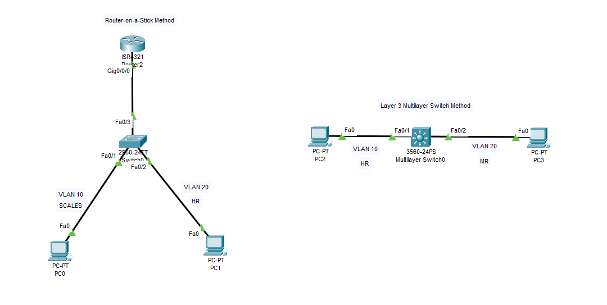

# 🌐 Cisco Inter-VLAN Routing Lab

A Cisco Packet Tracer lab demonstrating **Inter-VLAN Routing** using two different industry-standard methods:

1. **Router-on-a-Stick (ROAS)** (External Router with 802.1Q Subinterfaces)
2. **Layer 3 Multilayer Switch** (Internal Switched Virtual Interfaces - SVIs with Hardware Routing)

This lab demonstrates how devices in different VLANs and distinct IP subnets communicate through Layer 3 routing devices.

---

## 📸 Topology Diagram



---

## 📌 Lab Objectives

- Create and configure VLANs across Layer 2 and Layer 3 switches
- Assign switch ports to access VLANs
- Configure 802.1Q trunk links between switches and routers
- Configure Router-on-a-Stick Inter-VLAN Routing using router subinterfaces
- Configure SVI-based Inter-VLAN Routing on a Layer 3 Cisco Catalyst 3560 switch
- Configure host default gateways
- Verify VLAN, trunking, SVI, and IP routing table configurations
- Test end-to-end communication between different VLANs (`ping`)
- Evaluate the advantages and disadvantages of Router-on-a-Stick vs Multilayer Switching

---

## 🗺️ Topology Architectures

The lab contains two separate Inter-VLAN Routing implementations:

### Method 1: Router-on-a-Stick (ROAS)
```text
                         ROUTER-ON-A-STICK
                                
                              Router2
                            Cisco ISR 4321
                                |
                              Gi0/0/0
                                |
                             802.1Q TRUNK
                                |
                              Fa0/3
                          +------------+
                          |  Switch0   |
                          |   2960     |
                          +-----+------+
                                |
                      +---------+---------+
                      |                   |
                   Fa0/1               Fa0/2
                      |                   |
                   VLAN 10             VLAN 20
                      |                   |
                    PC0                 PC1
               192.168.10.10       192.168.20.10
```

### Method 2: Layer 3 Multilayer Switch
```text
                          LAYER 3 METHOD

                   +----------------------+
                   |   3560 Multilayer    |
                   |       Switch         |
                   +----------+-----------+
                              |
                   +----------+----------+
                   |                     |
                 Fa0/1                 Fa0/2
                   |                     |
                VLAN 10               VLAN 20
                   |                     |
                  PC2                   PC3
             192.168.10.10         192.168.20.10
```

---

## 🌐 IP Addressing Architecture

### 🔹 Router-on-a-Stick (ROAS) Addressing

| Device | Interface | VLAN ID | IP Address | Subnet Mask | Default Gateway |
| :--- | :--- | :---: | :--- | :--- | :--- |
| **PC0** | `FastEthernet0` | 10 | `192.168.10.10` | `255.255.255.0` | `192.168.10.1` |
| **PC1** | `FastEthernet0` | 20 | `192.168.20.10` | `255.255.255.0` | `192.168.20.1` |
| **Router2** | `Gi0/0/0.10` | 10 | `192.168.10.1` | `255.255.255.0` | — |
| **Router2** | `Gi0/0/0.20` | 20 | `192.168.20.1` | `255.255.255.0` | — |

---

### 🔹 Layer 3 Multilayer Switch Addressing

| Device | Interface | VLAN ID | IP Address | Subnet Mask | Default Gateway |
| :--- | :--- | :---: | :--- | :--- | :--- |
| **PC2** | `FastEthernet0` | 10 | `192.168.10.10` | `255.255.255.0` | `192.168.10.1` |
| **PC3** | `FastEthernet0` | 20 | `192.168.20.10` | `255.255.255.0` | `192.168.20.1` |
| **Multilayer Switch0** | `Vlan 10 (SVI)` | 10 | `192.168.10.1` | `255.255.255.0` | — |
| **Multilayer Switch0** | `Vlan 20 (SVI)` | 20 | `192.168.20.1` | `255.255.255.0` | — |

---

## 🔹 VLAN Configuration Table

| VLAN ID | Name | Subnet / Network | Gateway IP |
| :---: | :--- | :--- | :--- |
| **10** | `SCALES` / `HR` | `192.168.10.0/24` | `192.168.10.1` |
| **20** | `HR` / `MR` | `192.168.20.0/24` | `192.168.20.1` |

> **Design Note:** VLAN 10 and VLAN 20 use distinct IP subnets (`192.168.10.0/24` vs `192.168.20.0/24`), which is the fundamental requirement for Inter-VLAN Layer 3 routing.

---

# 1️⃣ Router-on-a-Stick (ROAS) Implementation

Router-on-a-Stick uses a **single physical router interface multiplexed into multiple virtual subinterfaces**. Each subinterface handles routing for a specific VLAN using 802.1Q tagging.

```text
PC0 (VLAN 10: 192.168.10.10) ──> Switch0 ──> 802.1Q Trunk ──> Router2 (Gi0/0/0.10 / Gi0/0/0.20)
                                                                       │ (Layer 3 Routing)
PC1 (VLAN 20: 192.168.20.10) <── Switch0 <── 802.1Q Trunk <─────────────┘
```

---

## ⚙️ Switch0 Configuration (2960 Layer 2 Switch)

```cisco
enable
configure terminal
hostname Switch0

! Step 1: Create VLANs
vlan 10
 name SCALES
 exit

vlan 20
 name HR
 exit

! Step 2: Configure PC0 Access Port (VLAN 10)
interface FastEthernet0/1
 switchport mode access
 switchport access vlan 10
 no shutdown
 exit

! Step 3: Configure PC1 Access Port (VLAN 20)
interface FastEthernet0/2
 switchport mode access
 switchport access vlan 20
 no shutdown
 exit

! Step 4: Configure Switch-to-Router Trunk Link
interface FastEthernet0/3
 switchport mode trunk
 switchport trunk allowed vlan 10,20
 no shutdown
 exit

end
write memory
```

---

## ⚙️ Router2 Configuration (Cisco ISR 4321 Router)

```cisco
enable
configure terminal
hostname Router2

! Step 5: Enable Physical Interface (No IP Address on physical interface)
interface GigabitEthernet0/0/0
 no shutdown
 exit

! Step 6: Configure Subinterface for VLAN 10
interface GigabitEthernet0/0/0.10
 encapsulation dot1Q 10
 ip address 192.168.10.1 255.255.255.0
 exit

! Step 7: Configure Subinterface for VLAN 20
interface GigabitEthernet0/0/0.20
 encapsulation dot1Q 20
 ip address 192.168.20.1 255.255.255.0
 exit

end
write memory
```

---

## 🧪 Router-on-a-Stick Testing

From PC0 (`192.168.10.10`) Command Prompt:
```cmd
ping 192.168.20.10
```

**Expected Output**:
```text
Pinging 192.168.20.10 with 32 bytes of data:
Reply from 192.168.20.10: bytes=32 time=1ms TTL=127
```

**Traffic Path**:
`PC0` ➔ `Switch0 Fa0/1 (VLAN 10)` ➔ `Trunk Fa0/3 (Tag 10)` ➔ `Router2 Gi0/0/0.10 (Gateway)` ➔ `Layer 3 Routing Engine` ➔ `Gi0/0/0.20 (Tag 20)` ➔ `Switch0 Trunk Fa0/3` ➔ `Switch0 Fa0/2` ➔ `PC1`.

---

# 2️⃣ Layer 3 Multilayer Switch (SVI Implementation)

The second method uses a **Cisco Catalyst 3560 Multilayer Switch**. Routing is performed internally in hardware via Switched Virtual Interfaces (SVIs) without needing an external router.

```text
                        Cisco Catalyst 3560
                         Multilayer Switch
                          /             \
                   SVI Vlan 10       SVI Vlan 20
                   192.168.10.1      192.168.20.1
                        |                 |
                       PC2               PC3
                  192.168.10.10     192.168.20.10
```

---

## ⚙️ Layer 3 Switch Configuration (3560 Switch0)

```cisco
enable
configure terminal
hostname MultilayerSwitch0

! Step 1: Create VLANs
vlan 10
 name HR
 exit

vlan 20
 name MR
 exit

! Step 2: Configure PC2 Access Port (VLAN 10)
interface FastEthernet0/1
 switchport mode access
 switchport access vlan 10
 no shutdown
 exit

! Step 3: Configure PC3 Access Port (VLAN 20)
interface FastEthernet0/2
 switchport mode access
 switchport access vlan 20
 no shutdown
 exit

! CRITICAL STEP 4: Enable Hardware IPv4 Routing
ip routing

! Step 5: Configure SVI (Default Gateway) for VLAN 10
interface Vlan 10
 ip address 192.168.10.1 255.255.255.0
 no shutdown
 exit

! Step 6: Configure SVI (Default Gateway) for VLAN 20
interface Vlan 20
 ip address 192.168.20.1 255.255.255.0
 no shutdown
 exit

end
write memory
```

---

## 🧪 Layer 3 Switch Testing

From PC2 (`192.168.10.10`) Command Prompt:
```cmd
ping 192.168.20.10
```

**Expected Output**:
```text
Pinging 192.168.20.10 with 32 bytes of data:
Reply from 192.168.20.10: bytes=32 time<1ms TTL=128
```

---

## ⚖️ Advantages and Disadvantages

### 🔹 Method 1: Router-on-a-Stick (ROAS)

#### ✅ Advantages of ROAS
1. **Hardware Cost Savings**: Works using standard Layer 2 switches and an existing router interface, avoiding the expense of dedicated Multilayer switches.
2. **Centralized Security Inspection**: Allows centralized Access Control Lists (ACLs), stateful inspection, and firewall policy enforcement between subnets on the router.
3. **Simple Small-Scale Setup**: Easy to implement in small offices or lab environments with low inter-VLAN bandwidth requirements.

#### ❌ Disadvantages of ROAS
1. **Physical Bandwidth Bottleneck ("Traffic Hairpinning")**: All inter-VLAN traffic travels up the single physical trunk link to the router and back down the same link, bottlenecking throughput to link capacity (e.g., 1 Gbps).
2. **Single Point of Failure**: If the physical trunk interface or router fails, all inter-VLAN routing across the enterprise halts.
3. **Software-Based Latency**: Router CPU/software packet forwarding introduces higher latency compared to hardware ASIC switching.

---

### 🔹 Method 2: Layer 3 Multilayer Switch (SVI Routing)

#### ✅ Advantages of Layer 3 Switch Routing
1. **Wire-Speed ASIC Performance**: Routes packets directly in hardware using Application-Specific Integrated Circuits (ASICs), achieving gigabit/multi-gigabit line-rate throughput with near-zero latency.
2. **Eliminates Hairpin Bottlenecks**: Routing occurs internally across the switch backplane without traversing external physical cables.
3. **High Port Density & Scalability**: Supports hundreds of SVIs and high-density local switchports without requiring extra router interfaces.
4. **Enhanced Redundancy**: Integrates seamlessly with First Hop Redundancy Protocols (HSRP/VRRP) and EtherChannel trunk bundles.

#### ❌ Disadvantages of Layer 3 Switch Routing
1. **Higher Initial Hardware Cost**: Multilayer switches (e.g., Cisco 3560, 3850, Catalyst 9300) are considerably more expensive than basic Layer 2 switches.
2. **IOS Licensing Requirements**: Requires IP Base or IP Services / Network Essentials licensing to unlock `ip routing` capabilities.
3. **Limited Advanced WAN Features**: Lacks specialized WAN features such as NAT, IPSec VPN, and deep WAN packet inspection provided by dedicated routers (e.g., ISR 4000 series).

---

## 🆚 Method Comparison: Router-on-a-Stick vs Layer 3 Switch

| Feature | Router-on-a-Stick (ROAS) | Layer 3 Multilayer Switch |
| :--- | :--- | :--- |
| **Routing Device** | External Router | Multilayer Switch |
| **Routing Mechanism** | Subinterfaces (`Gi0/0/0.10`) | Switched Virtual Interfaces (`Vlan 10`) |
| **Trunk Cable Required?** | ✅ Yes (Router to Switch) | ❌ No (Internal Backplane Routing) |
| `encapsulation dot1Q` | Required on subinterfaces | Not required on SVIs |
| `ip routing` Command | Not required (Enabled by default) | **Required** (`ip routing`) |
| **Default Gateway** | Router Subinterface IP | SVI IP Address |
| **Throughput & Latency** | Lower (Hairpin bottleneck) | High (Wire-speed ASIC switching) |
| **Best Used For** | Small offices, legacy labs | Enterprise campus, data centers |

---

## 🔍 Verification Commands

### 1. Check VLAN Status
```cisco
show vlan brief
```

### 2. Check Trunk Links (ROAS Method)
```cisco
show interfaces trunk
```

### 3. Check IP Interfaces
On Router:
```cisco
show ip interface brief
```
On Multilayer Switch:
```cisco
show ip interface brief
```

### 4. Check IP Routing Table
```cisco
show ip route
```
*Verify connected routes for `192.168.10.0/24` and `192.168.20.0/24` appear in the table.*

### 5. Check SVI Operational Status
```cisco
show interfaces vlan 10
show interfaces vlan 20
```

---

## 🛠️ Troubleshooting Checklist

If Inter-VLAN communication fails:
1. **Verify VLAN Existence**: Run `show vlan brief` on switches.
2. **Verify Access Ports**: Run `show interfaces switchport` to confirm access VLAN assignments.
3. **Verify Trunk Configuration**: Run `show interfaces trunk` (Ensure VLAN 10 & 20 are allowed).
4. **Verify `encapsulation dot1Q`**: Ensure subinterface VLAN IDs match (`encapsulation dot1Q 10`).
5. **Verify `ip routing`**: On 3560 switch, confirm `ip routing` is enabled in `show running-config`.
6. **Verify SVI Admin Status**: Ensure SVIs are `up/up` (`no shutdown`).
7. **Verify Host Default Gateways**: Confirm PCs point to their respective gateway IPs (`192.168.10.1` and `192.168.20.1`).

---

## 📚 Key Concepts Summary

- **VLAN**: Logical Layer 2 broadcast domain isolation.
- **Access Port**: Carries un-tagged frames for a single VLAN.
- **Trunk Port**: Carries 802.1Q tagged frames for multiple VLANs.
- **Inter-VLAN Routing**: Transporting packets between separate VLANs via Layer 3 routing.
- **Subinterface**: Logical division of a physical router interface (`Gi0/0/0.10`).
- **SVI (Switched Virtual Interface)**: Virtual Layer 3 interface on a switch associated with a VLAN (`interface Vlan 10`).

---

## 🎯 Learning Outcomes

After completing this lab, you are able to:
- Configure VLANs, access ports, and 802.1Q trunk links.
- Implement Router-on-a-Stick Inter-VLAN routing using subinterfaces.
- Implement SVI-based Inter-VLAN routing on Layer 3 switches using `ip routing`.
- Configure host default gateways for multi-subnet topologies.
- Verify routing tables and interfaces via Cisco IOS CLI commands.
- Compare and select the optimal Inter-VLAN routing design for enterprise networks.

---

## 💻 Software & Environment

- **Simulator**: Cisco Packet Tracer
- **Hardware**: Cisco ISR 4321 Router, Cisco Catalyst 2960 Switch, Cisco Catalyst 3560 Multilayer Switch
- **Operating System**: Cisco IOS Software

---

## 👨‍💻 Author & License

- **Author**: Kudupudi Chakresh Ram (`chakreshram11`)
- **Repository**: [Networking Labs](https://github.com/chakreshram11/Networking-Labs)
- **Status**: Completed 🟢
